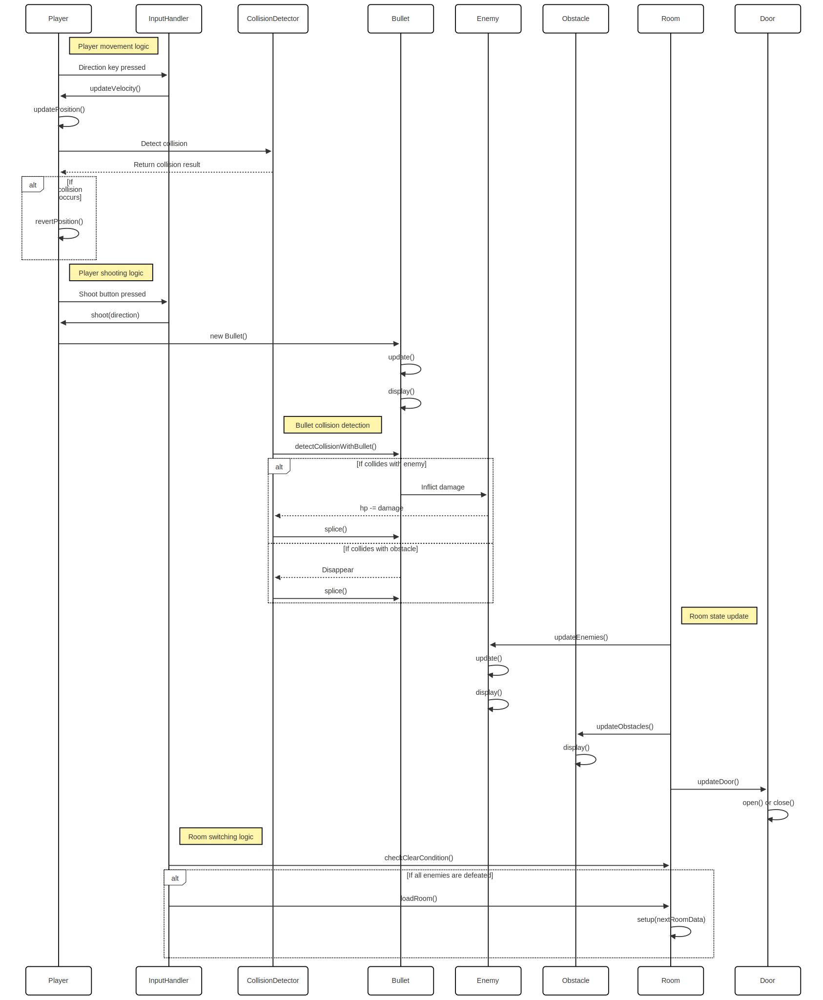

# 2025-group-17
2025 COMSM0166 group 17
## Your Game

[Link to our game!](https://uob-comsm0166.github.io/2025-group-17/public/)

Your game lives in the [/docs](/docs) folder, and is published using Github pages to the link above.

Include a demo video of your game here (you don't have to wait until the end, you can insert a work in progress video)

## Your Group

 

| Name | GitHub Profile | Email | Role |
|-|-|-|-|
| Yishan Chen  | [shandy-del](https://github.com/shandy-del)         | sf24245@bristol.ac.uk   | role |
| Yuetong Dong | [Catherinett-111](https://github.com/Catherinett-111) | wv24137@bristol.ac.uk   | role |
| Shuzhou Huang| [EnjoyerGG](https://github.com/EnjoyerGG)           | uq24650@bristol.ac.uk   | role |
| Hong Jin     | [h-d-jin](https://github.com/h-d-jin)               | sd24459@bristol.ac.uk   | role |
| Yuzheng Li   | [Kkan6](https://github.com/Kkan6)                   | nb24046@bristol.ac.uk   | role |
| Zhexing Yang | [ZhexingYoung](https://github.com/ZhexingYoung)     | ec24179@bristol.ac.uk   | role |

## Kanban Board
https://www.notion.so/1827d976fa2680a4b440cbe594a6a63d?v=1827d976fa26807b9c51000c642e4ac8&pvs=4

## Project Report

### Introduction

Our game *Out* draws inspiration from *The Binding of Isaac*, the renowned 2D platformer RPG and action-adventure game developed by Edmund McMillen. Similar to the original, players progress through a series of carefully designed levels and enemies, using projectile-based combat to defeat monsters across various dungeon environments, earning points and advancing the narrative.

However, *Out* introduces several key innovations that distinguish it from its predecessor. Building on the core gameplay loop, we have implemented a procedurally generated obstacle system alongside a timer-based mechanic. These features are intended to encourage repeated playthroughs, motivating players to surpass their own completion records and embrace the satisfaction of self-improvement through challenge.

On the artistic level, we have created original, hand-drawn visuals to support seamless narrative delivery. Ultimately, we hope that the game can serve not only as a medium for entertainment but also as a reflective space in which players may find resonances with their own lives.

### Requirements 

<!-- - 15% ~750 words
- Use case diagrams, user stories. Early stages design. Ideation process. How did you decide as a team what to develop? -->

<!-- Reflection on requirement engineering -->
During the workshop in Week 4, we explored the process of requirement engineering by identifying various stakeholders and determining their expectations. To estimate the user value of our game, we utilized the onion model to hierarchically consider stakeholders and gather potential requirements beyond our team's initial scope. Outlining the epics and user stories helps us break them into smaller, manageable tasks, specifying what the team should build in each sprint cycle. This approach ensures clear and measurable requirements, detailing the time and effort required from the development team. By assigning smaller tasks to each team member, we minimize the impact of adjustments, keeping our team agile and adaptable. We also consider the diverse needs of different users, which allows each team member to focus on independent and achievable goals, thereby reducing the risk associated with complex objectives. The acceptance criteria are crucial for identifying deliverable outcomes and prioritizing solutions that work for most people. Furthermore, communicating requirements within the team enhances our ability to gather feedback among the team members and reflect on changes before modifying the actual code. With the help of it, we can be more flexible to the demands that change frequently, which fits the spirit of agile development.

#### Epic and User Stories
**Epic 1: Players with different gaming experiences**

As a player,
I want to get inspired and relax during the gameplay,
so that I can enjoy the game regardless of my previous gaming experiences.

| User Story | Acceptance Criteria |
|----------|----------|
| As a **casual player**, I want to save my game progress frequently, so that I can return to play without losing significant progress. | Given the player reaches the end of each sub-level, When the player passes by a save point, Then the game saves the current progress and provides a confirmation message. |
| As an **explorer player**, I want to explore all the easter eggs and gain all the achievements, so that I can explore every interesting aspect and experience of this game. | Given the player reaches the optional challenge level/room, When the player beats all the enemies in this room, Then they would gain different skill sets or bonus points. |
| As a **competitive player**, I want to see trackers for my performance, so that I can compare with other players. | Given the player completes all the levels, When the end screen is displayed and the user enters their username, Then the player’s name and score are shown along with their rank on the leaderboard for that level.
| As a **new player**, I want to learn the basic controls and terminologies, so that I can quickly learn how to play without frustration. | Given the game is started for the first time, When the user selects "New Game", Then an interactive tutorial provides step-by-step guidance on moving, jumping, and collecting items. |
| As a **story seeker**, I want to meet all the items and unlock all the elements of the game. | Given the player has finished all the levels, When every time play the game, Then new grap of the game will be achieved. |

**Note**: The potential stakeholders are marked as **bolded** above.

### Design

- 15% ~750 words 
- System architecture. Class diagrams, behavioural diagrams. 
 
 

### Implementation

- 15% ~750 words

- Describe implementation of your game, in particular highlighting the three areas of challenge in developing your game. 

### Evaluation

- 15% ~750 words

- One qualitative evaluation (your choice) 

Heuristic Evaluation

| Name | Interface | Issue | Heuristic(s) | Freguency 0 (rare) to 4 (common) | Impact 0 (easy) to difficult (4) | Persistence 0 (once) to 4 (repeated) | Severity = Sum Total of F+I+P/3 |
|----------|----------|----------|----------|----------|----------|----------|----------|
| Hsinyun Fan | Tutorial Interface | Don't know when player is attacked by enemies. | Visibility of system status | 2 | 2 | 0 | 1.25 |
| Kailin Fang | Tutorial Interface | Instruction could be more clear (like use picture to show). | Help and documentation | 1 | 2 | 1 | 1.33 |
| Daisy Fan | Tutorial Interface | Can pop up instruction first then begin. The HP not very clear. | Help and documentation | 1 | 2 | 1 | 1.33 |
| Brian | Tutorial Interface | Don't know how to win or play when just eneter the game. | Visibility | 1 | 4 | 1 | 2 |
| Kaijie Xu | "Playing" Interface | Player identification | Recognition rather than recall. | 2 | 2 | 4 | 2.67 |
| Rowan | Pause Menu | Hard to see the pause button | Visibility of system status, Consistency and standards, Error prevention, Recognition rather than recall, Flexibility. | 1 | 1 | 0 | 0.67 |
| Rowan | "Playing" Interface | Difficult to avoid enemies | Visibility of system status, Consistency and standards, Error prevention, Recognition rather than recall, Aesthetic | 4 | 3 | 2 | 3 |
| Aya | "Playing" Interface | Hard to defeat enemy, takes many shoots | Flexibility and efficiency of use | 2 | 3 | 2 | 2.33 |
| A | "Playing" Interface | I'm not used to operating keys. The display of the player's health is not very obvious and is not easy to see at a glance. | User control and freedom. | 1 | 0 | 1 | 0.67 |
| A | "Playing" Interface | The monster is moving too fast. It is better to show the monster's health. | User control and freedom. | 2 | 2 | 1 | 1.67 |
| James | Tutorial Interface, "Playing" Interface | It’s a little bit hard for recognize the tutorial image of the first level. | Visibility of system status, Flexibility and efficiency of use | 2 | 2 | 1 | 1.67 |
| James | "Playing" Interface, Game Over Interface | Hard game and hard to find the button to restart the game. | User control and freedom, Recognition rather than recall | 3 | 3 | 3 | 3 |
| Farid | "Playing" Interface | Bullet is a bit too slow | Visibility of system status, Flexibility and efficiency of use | 3 | 2 | 3 | 2.67 |
| Jacque | "Playing" Interface | Collision with box, health visibility | User control and freedom, Aesthetic and minimalist design | 2 | 0 | 3 | 1.67 |
| Ziqi | "Playing" Interface |  | User control and freedom | 2 | 2 | 1 | 1.67 |
| Hao | Start Menu | The playing button is too small | Aesthetic and minimalist design  | 1 | 2 | 1 | 1.33 |
| Beam | "Playing" Interface | Collision detection is a bt off | User control and freedom | 4 | 3 | 1 | 2.67 |
| Marek | "Playing" Interface | Too small buttons starts very quickly, once you play it more bcomes easier  | Visibility of system status, User control and freedom  | 1 | 1 | 3 | 1.67 |
| Oliver | "Playing" Interface | Enemies can phase through the obstacles in the level, which is unintuitive that the player can't either. The hitboxes are quite tight which can halt movement if you're colliding with 1 pixel | User control and freedom  | 1 | 1 | 3 | 1.67 |
| Luciano | Pause Menu, "Playing" Interface | Sometimes movement didn't work. Obstacle location being random each time can make level 3 easier than level 1. | User control and freedom, Aesthetic and minimalist design  | 2 | 3 | 4 | 3 |
| Alexandros | "Playing" Interface | The hitboxes on the blue computers were a bit too big | Flexibility and efficiency of use  | 3 | 1 | 4 | 2.67 |
| Ashby | "Playing" Interface | The obstacles looked smaller than they actually were. It was a bit easy to just spam attack.  | User control and freedom, Consistency and standards, Flexibility and efficiency of use  | 2 | 1 | 3 | 2 |
| Asher | "Playing" Interface | Hitboxes too large, not obvious that music notes stop when they hit obstacles, cannot move left or right when also moving into an obstacle, saving is not clear | Visibility of system status, User control and freedom, Consistency and standards, Flexibility and efficiency of use, Help users recognise, diagnose, and recover from errors | 4 | 3 | 0 | 2.33 |
| gg | Start Menu |  | Flexibility and efficiency of use | 1 | 3 | 1 | 1.67 |

- One quantitative evaluation (of your choice) 

- Description of how code was tested. 

### Process 

- 15% ~750 words

- Teamwork. How did you work together, what tools did you use. Did you have team roles? Reflection on how you worked together. 

### Conclusion

- 10% ~500 words

- Reflect on project as a whole. Lessons learned. Reflect on challenges. Future work. 

### Contribution Statement

- Provide a table of everyone's contribution, which may be used to weight individual grades. We expect that the contribution will be split evenly across team-members in most cases. Let us know as soon as possible if there are any issues with teamwork as soon as they are apparent. 

### Additional Marks

You can delete this section in your own repo, it's just here for information. in addition to the marks above, we will be marking you on the following two points:

- **Quality** of report writing, presentation, use of figures and visual material (5%) 
  - Please write in a clear concise manner suitable for an interested layperson. Write as if this repo was publicly available.

<!-- **Documentation** of code (5%)

  - Is your repo clearly organised? 
  - Is code well commented throughout? -->
