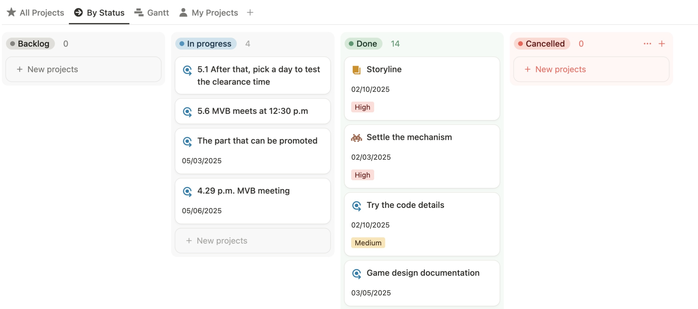

# 2025-group-17
2025 COMSM0166 group 17
## Your Game

&nbsp;&nbsp;[Link to our game!](https://uob-comsm0166.github.io/2025-group-17/public/)&nbsp;&nbsp;&nbsp;&nbsp;&nbsp;

## Your Group

 <br>

| Name | GitHub Profile | Email | Role |
|-|-|-|-|
| Yishan Chen  | [shandy-del](https://github.com/shandy-del)         | sf24245@bristol.ac.uk   | role |
| Yuetong Dong | [Catherinett-111](https://github.com/Catherinett-111) | wv24137@bristol.ac.uk   | role |
| Shuzhou Huang| [EnjoyerGG](https://github.com/EnjoyerGG)           | uq24650@bristol.ac.uk   | role |
| Hong Jin     | [h-d-jin](https://github.com/h-d-jin)               | sd24459@bristol.ac.uk   | role |
| Yuzheng Li   | [Kkan6](https://github.com/Kkan6)                   | nb24046@bristol.ac.uk   | role |
| Zhexing Yang | [ZhexingYoung](https://github.com/ZhexingYoung)     | ec24179@bristol.ac.uk   | role |


## Kanban Board
https://www.notion.so/1827d976fa2680a4b440cbe594a6a63d?v=1827d976fa26807b9c51000c642e4ac8&pvs=4

## Project Video

https://www.youtube.com/watch?v=58hXDIqVQvE

## Project Report &nbsp;

### Table of Content

<details>
<summary>Click to expand</summary>

1. [Introduction](#1-introduction)
2. [Requirements](#2-requirements)
   - 2.1 [Ideation process & Early stages design](#21-ideation-process--early-stages-design)
   - 2.2 [Stakeholder Identification](#22-stakeholder-identification)
   - 2.3 [Epic and User Stories](#23-epic-and-user-stories)
   - 2.4 [Use-Case Modelling](#24-use-case-modelling)
3. [Design](#3-design)
   - 3.1 [System Overview](#31-system-overview)
   - 3.2 [Class Design](#32-class-design)
4. [Implementation](#4-implementation)
5. [Evaluation](#5-evaluation)
   - 5.1 [Qualitative Evaluation - Heuristic Evaluation](#51-qualitative-evaluation---heuristic-evaluation)
   - 5.2 [Quantitative Evaluation - System Usability Survey (SUS)](#52-quantitative-evaluation---system-usability-survey-sus)
   - 5.3 [Improvements of the final version](#53-improvements-of-the-final-version)
   - 5.4 [Testing](#54-testing)
6. [Process](#6-process)
   - 6.1 [Team Collaboration and Workflow](#61-team-collaboration-and-workflow)
   - 6.2 [Tools and Technologies](#62-tools-and-technologies)
7. [Sustainability, Ethics and Accessibility](#7-sustainability-ethics-and-accessibility)
   - 7.1 [The Sustainability Awareness Framework](#71-the-sustainability-awareness-framework)
   - 7.2 [Green Software Foundation Implementation Patterns Applied in the Project](#72-green-software-foundation-implementation-patterns-applied-in-the-project)
   - 7.3 [Privacy & Security](#73-privacy--security)
8. [Conclusion](#8-conclusion)
9. [Contribution Statement](#9-contribution-statement)
10. [Acknowledgements](#10-acknowledgements)
</details>

### 1. Introduction


Our game *Out* is inspired by *The Binding of Isaac*, a well-known 2D action-adventure and RPG platformer created by Edmund McMillen. Like the original, players move through a series of thoughtfully designed levels and enemies, using projectile-based combat to fight monsters in different dungeon settings, gaining points and gradually uncovering the story.

But *Out* adds several unique features that set it apart. On top of the familiar gameplay, we’ve introduced a system of procedurally generated obstacles and a timer mechanic. These additions are designed to encourage players to replay the game, pushing themselves to beat their previous times and enjoy the process of self-improvement through challenge.

Artistically, the game features original hand-drawn visuals that help tell the story more immersively. In the end, we hope *Out* can be more than just a fun game—it’s also meant to be a space for reflection, where players might see parts of their own experiences echoed in the journey.

### 2. Requirements 

#### 2.1 Ideation process & Early stages design
We started the ideation process by exploring games on the markets in Week 1 and came up a [list](./WeeklyTasks/W1.md#game-mechanisms) of possible game mechanisms and ideas. After brainstorming and discussion in Week 2, we narrowed down the list to three ideas below. Despite the rest of the game ideas have not been prototyped, the mechanisms extracted from them, such as using random events to improve users' engagement, have set the foundation for the finalised game. Finally, we considered the feasibility of implementation, and the feedback gained from other teams during the workshop in Week 3. As a result, we decided to go with an advantage beat 'em all similar to The Binding of Isaac.

| Game Idea | Inspried by | Game Mechanisms | Possible Challenges |
|-|-|-|-|
| [Out](https://youtu.be/wU7b8NAj1_g?si=eox95n0rkYJhKN4H) | The Binding of Isaac | <ul><li> Players aim to defeat all the enemies to complete the game. </li><br><li> Every playthrough has a random layout of rooms and items </li><br><li> Save point enables players to reload the save data when they died. </li></ul> | <ol><li> Careful design for collision detection to replicate the experience of the original game </li><br><li> Vivid visual and audio feedback, including cutscenes and in-game progress notices </li></ol> |
| [Untitled](https://www.youtube.com/watch?v=__04UEmjg2M) | Star kirby | <ul><li> Players aim to score higher points by collecting items </li><br><li> Player can get an achievement when they collect certain items </li><br><li> Random items/events will give players unique abilities </li></ul> | <ol><li> Design of the item system and their corresponding player's abilities </li><br><li> Make sure each level is unique and has a reasonable difficulty curve </li></ol> |
| Majhontro | Balatro | <ul><li> Players aim to score higher points by different combinations of the current tiles </li><br><li> Boss levels introduce restrictions on card playing or drawing. </li><br><li> Random tile generation ensures the game replayability </li></ul> | <ol><li> Replace suit logic with a Mahjong tile </li><br><li> Design tile combination and rules for bonus points </li></ol> |

*Table 1. List of game ideas. Click the game title to see the corresponding paper prototype video.*

#### 2.2 Stakeholder Identification
During the workshop in Week 4, we explored the process of requirement engineering by identifying various stakeholders and determining their expectations. To estimate the user value of our game, we utilised the onion model to hierarchically consider stakeholders and gather potential requirements beyond our team's initial scope. We first came out a list of possible stakeholders with their relation and effects to the game in Table 2, and then used onion model to identify the stakeholders to priorities, as shown in Figure 1.

<!-- List of stakeholders -->
| Stakeholder | Role/interest | Impact |
|-|-|-|
| **Team Members**| Develop the game; grades depend on its quality. | Directly responsible for design, implementation, and quality. |
| **Target Players** | Game must align with their preferences. | Feedback shapes game mechanics, UI/UX, and overall enjoyment. |
| **Markers** | Assess and grade the project; provide official feedback. | Influence final evaluation and suggest improvements. |
| **Other Groups (Peers)** | Exchange feedback during labs. | Peer insights help refine the game before final submission. |
| **Testathon Testers** | Take part in HCI evaluation through gameplay testing. | Identify usability issues, bugs, and areas for improvement. |
| **Future Students** | May use the project/report as reference or inspiration. | The project’s readme file could serve as a learning resource. |
| **Teaching Team** | May showcase the project to engage future students. | Can highlight the game as an example of coursework standards. |
| **Potential Sponsors** | Could fund or support further development post-coursework. | Financial/technical backing could extend the game’s lifecycle. |
| **Testathon Organisers** | Use the number of participation to plan future events (frequency, venue size). | \- |

*Table 2. List of stakeholders.*

<!-- Onion Model -->
 <br>
*Figure 1. Onion Model.*

#### 2.3 Epic and User Stories
<!-- Reflection on requirement engineering -->
After identifying the key users, we decided to priorities the needs of different players. Outlining the epics and user stories helps us break them into smaller, manageable tasks, specifying what the team should build in each sprint cycle. This approach ensures clear and measurable requirements, detailing the time and effort required from the development team. By assigning smaller tasks to each team member, we minimise the impact of adjustments, keeping our team agile and adaptable. We also consider the diverse needs of different users, which allows each team member to focus on independent and achievable goals, thereby reducing the risk associated with complex objectives. The acceptance criteria are crucial for identifying deliverable outcomes and prioritising solutions that work for most people. Furthermore, communicating requirements within the team enhances our ability to gather feedback among the team members and reflect on changes before modifying the actual code. With the help of it, we can be more flexible to the demands that change frequently, which fits the spirit of agile development. **Note**: The potential stakeholders are marked as **bolded** below.

> **Epic 1: Improve user diversity**
>
> | User Story | Acceptance Criteria | Value | Effort | MoSCoW |
> |-|-|-|-|-|
> | As a **casual player**, I want to save my game progress frequently, so that I can return to play without losing significant progress. | Given the player reaches the end of each sub-level, When the player passes by a save point, Then the game saves the current progress and provides a visual confirmation feedback. | High | Low | Must-have |
> | As a **competitive player**, I want to see trackers for my performance, so that I can compare with other players. | Given the player completes all the levels, When the end screen is displayed, Then the player’s time taken are shown. | High | Low | Must-have |

> **Epic 2: Enhance player immersions**
> 
> | User Story | Acceptance Criteria | Value | Effort | MoSCoW |
> |-|-|-|-|-|
> | As a **roleplayer**, I want to see the storyline, so that I know better about the character's motivations, goals, and the place in the world. | <ul><li> Given a player presses the "New Game" button, When the new game is started, Then the prologue introduces the main character and setting. </li><br><li> Given the player defeats the final boss, When the user's time taken finish displayed, Then the epilogue wraps up the story. </li></ul> | High | High | Should-have |

> **Epic 3: Eahance ease of use**
> 
> | User Story | Acceptance Criteria | Value | Effort | MoSCoW |
> |-|-|-|-|-|
> | As a **first-time player**, I want a clear description of each button so that I don’t get confused about what I can do on each menu page. | <ul><li> Given the player is on a menu page, When they hover over or select a button, Then they see a conceptual tip explaining what the button does. </li><br><li> Given the player is on a menu page, When a keyboard shortcut is available (e.g., ESC to exit), Then the shortcut is clearly displayed on the help bar. </li></ul> | High | High | Should-have |
> | As a **still-learning player**, I want instant access to an in-game control tutorial so that I can check the controls without affecting my game progress. | Given the player pauses during gameplay, When they select the tutorial option, Then they see an image tutorial explaining the controls. | High | Low | Must-have |
> | As a **player not particularly skilled at precise controls**, I want to receive stat boosts or recover before the final boss so that I can reduce frustration. | Given the player is approaching the final boss stage, When they complete a preceding level, Then an item that improves character's stats or increase their health drops. | High | High | Should-have |

When prioritising user stories, we consider value versus effort and apply the MoSCoW method. Value and effort estimations are based on feedback from lab sessions (see Figure 2 for an example) and team discussions. With the minimum viable product (MVP) as our initial goal, we first implemented the must-have requirements, followed by additional features after the initial game version was completed.

 <br>
*Figure 2. Feedback gathering from game testing activity in Week 4.*


#### 2.4 Use-Case Modelling
We utilised a use-case diagram shown in Figure 3, along with the use-case specifications, to better evaluate the time and effort required to implement each interface and in-game interaction, while also keeping the entire team aligned on the gameplay flow.

 <br>
*Figure 3. Use-case Diagram.*

> **Use-case specification 1: Win/lose** <br>
> **Description:** This use-case describes how players interact with enemies and health mechanics.  
> 
> | **Flow Type** | **Steps** |
> |-|-|
> | **Basic Flow** | 1. Player begins gameplay with 3 HP. <br> 2. Player encounters enemies. <br> 3. If player takes damage (attack/collision), they lose 1 HP. <br> 4. Player defeats all the enemies and completes the game. |
> | **Alternative Flow** | 1. When HP reaches 0, game displays "Game Over" screen. <br> 2. Player can restart from main menu or "Game Over" screen. |

> **Use-case specification 2: Save/load** <br>
> **Description:** This use-case describes how players interact with the save/load system.  
> 
> | **Flow Type** | **Steps** |
> |-|-|
> | **Basic Flow** | 1. Player begins gameplay with 3 HP. <br> 2. Player encounters enemies and savepoints. <br> 3. When HP reaches 0, game displays "Game Over" screen. <br> 4. Player can restart from main menu or "Game Over" screen. |
> | **Alternative Flow** | 1. Player passes by a savepoint. <br> 2. Player loads saved game from main menu or "Game Over" screen. <br> 3. The player restarts in the room they were in and with the health and boost they had when they last passed a savepoint. |

### 3. Design
<!-- 
- 15% ~750 words 
- System architecture. Class diagrams, behavioural diagrams. 
-->
The design of **Out** follows a structured and modular object-oriented architecture, informed by key principles of encapsulation, abstraction, inheritance, polymorphism, and composition. 
#### 3.1 Class Design
<div style="width: 100%; overflow-x: auto;">
  
</div>

*Figure 4. Class Diagram.*

The system follows a four-layer architecture, with the class diagram clearly showing the key components in each layer:
- **Core Control Layer:** The ```GameStateManager``` acts as the central hub, coordinating the ```EventBus``` for event handling, the ```InputHandler``` for input processing and the ```MenuDrawer``` for managing and rendering all in-game menus and their interaction logic.
- **Entity Layer:** This layer includes game entities such as ```Player```, ```Enemy```, ```Chaser```, ```Shooter``` and their subclasses, as well as the ```Bullet``` system, ```Room```, ```Door```, ```Obstacle```, ```Item```, and ```SavePoint```. These components use inheritance and composition to support diverse and dynamic behaviors. The ```CollisionDetector``` class is the core collision detection system of the game, responsible for handling all collision logic between game entities.
- **UI Layer:** The ```MenuDrawer``` and ```HelpBar``` classes use the state pattern to manage the user interface. Scene transitions at the start and end of the game are handled by the ```ScenePlayer``` class, while the ```FadeManager``` manages fade-in and fade-out effects during room transitions. Classes such as ```PlayerStatusDisplayer```, ```BossStatusDisplayer```, ```InstructionDisplayer```, and ```PolicyDisplayer``` use static methods for efficient rendering.
- **Communication Layer:** The ```EventBus``` class uses the publish-subscribe pattern to decouple different modules. For example, a menu event can trigger a transition in the game state.

#### 3.2 Behavioural Diagrams

*Figure 5. Sequence Diagram of Initialization Process.*

*Figure 6. Sequence Diagram of Main loop Process.*

*Figure 7. Sequence Diagram of System interaction Process.*

### 4. Implementation
#### 4.1 Sprite and visual feedback
One of the key challenges we faced was making sure enemies in different levels not only moved and attacked, but also looked visually distinct and animated. Initially, our game used single static images for each enemy type, which made them appear lifeless and less engaging. To improve the visual quality and communicate level-specific identity, we wanted enemies in different levels to have different animation styles and sprite sheets.

 </br>
*Figure 8. Illustration of sprite and visual feedback*

To achieve this, we first prepared separate sprite images for each enemy type across different levels. Then, instead of hardcoding sprite logic into each enemy class, we decided to use a centralized system: during room setup in `Room.js`, we dynamically assigned the correct animation frames based on the level ID. This way, for example, Level 3’s `Chaser` and `Shooter` would be linked to `window.chaserFramesL3` and `window.shooterFramesL3`, while lower levels still used the default animations.

The actual animation is implemented using a simple frame-switching timer. Each enemy class (like Chaser and Shooter) has `frameCounter` and `currentFrame` attributes. In the `update()` function, we increase `frameCounter`, and when it exceeds a threshold (e.g., every 10 frames), we cycle to the next sprite. This ensures animations are smooth but not too fast, and the system is shared by all enemy types. 

We also use sprites for visual feedback. As seen in Figure 4, the player can easily identify if a bullet hits an enemy or wall through the corresponding visual effects. Additionally, we added both visual and audio feedback to help players track game progress. Unlike regular enemies, the defeat of the boss is marked by a shaking effect and a distinct death sound, with the shaking effect shown in Figure 4.

#### 4.2 Add realism to game
Another challenge we faced was creating a sense of realism during gameplay. Of all the efforts we made to address this, collision detection takes the largest number of sprints to integrate. In the initial version, collisions were calculated based on the edges of PNG images, which made the collision between entities appear like interaction between two flat images. After receiving feedback during evaluation, we aimed to introduce depth into the implementation to simulate the z-axis (see details in Table 3). In the final version, we decided to use only the bottom area of the image for collision detection, and use the Y-axis coordinates to ensure a more accurate 2.5D depth representation.

| Attempts | In-game behaviour | Implementation in details
|-|-|-|
| **Version 1: image-based detection** |  | Collision is detected based on the position and dimensions of the image, which can incorrectly trigger on transparent areas. |
| **Version 2: bottom-only collision** |  | Collision is limited to the center and bottom of the character to reflect their actual position — their feet. However, the player appears above other entities even when standing behind them, which looks unnatural. |
| **Version 3: separate layers** |  | The player is drawn on a separate layer. This still causes unnatural visuals when moving in front of other entities, as layering doesn’t reflect true depth. |
| **Final version: y-axis sorting** |  | Entities are sorted and drawn based on their Y-axis position. Make entities at the "top" of the screen render behind objects at the "bottom" of the screen, creating a natural depth effect. |

*Table 3. Iteration of 2.5D collision detection*

In addition to the 2.5 effects on collisions, we aimed to make object movements feel more natural by adding physical effects. We improved the player’s movement by adding friction (`#friction`) and inertia through acceleration (`#acceleration`), resulting in smoother and more responsive controls. Instead of abrupt stops, the player now decelerates gradually when input ceases, thanks to the `applyFriction()` method. We also enhanced item drops by controlling their velocity with gravity (`#gravity`) and bounce (`#bounce`) mechanics, making them fall and rebound more realistically. The `#handleGroundCollision()` method ensures items settle naturally by reducing their bounce velocity until they come to rest.

#### 4.3 Sound effects
While not listed as one of our challenges in the plan, another challenges we encountered was how to manage background music and sound effects dynamically across rooms and gameplay states. For example, each level had a different background track, and certain moments like pausing the game required special audio effects (e.g., low-pass “telephone” filter). We also wanted to avoid overlapping or abrupt changes in audio playback when transitioning between levels or states.

To solve this, we created a centralized sound manager in `GameStateManager.js` that handles music playback based on the current room’s level ID. We used the `p5.sound` library to load all BGM files during `preload()` and played them using `.loop()` when the room started. To prevent redundant playback, we only switched tracks when the target BGM was different from the current one.

For the pause effect, we applied a `LowPass filter` provided by `p5.sound`. When the game enters the pause state, we route the currently playing BGM through this filter and lower the overall volume. When the player resumes, we disconnect the filter and restore the original volume. This adds an immersive "muted" feel to the pause state without interrupting the track entirely.

### 5. Evaluation
#### 5.1 Qualitative Evaluation - Heuristic Evaluation

<details>
  <summary>Heuristic Evaluation Results</summary>
<br>

| Name | Interface | Issue | Heuristic(s) | Freguency 0 (rare) to 4 (common) | Impact 0 (easy) to difficult (4) | Persistence 0 (once) to 4 (repeated) | Severity = Sum Total of F+I+P/3 |
|----------|----------|----------|----------|----------|----------|----------|----------|
| Hsinyun Fan | Tutorial Interface | Don't know when player is attacked by enemies. | Visibility of system status | 2 | 2 | 0 | 1.25 |
| Kailin Fang | Tutorial Interface | Instruction could be more clear (like use picture to show). | Help and documentation | 1 | 2 | 1 | 1.33 |
| Daisy Fan | Tutorial Interface | Can pop up instruction first then begin. The HP not very clear. | Help and documentation | 1 | 2 | 1 | 1.33 |
| Brian | Tutorial Interface | Don't know how to win or play when just eneter the game. | Visibility | 1 | 4 | 1 | 2 |
| Kaijie Xu | "Playing" Interface | Player identification | Recognition rather than recall. | 2 | 2 | 4 | 2.67 |
| Rowan | Pause Menu | Hard to see the pause button | Visibility of system status, Consistency and standards, Error prevention, Recognition rather than recall, Flexibility. | 1 | 1 | 0 | 0.67 |
| Rowan | "Playing" Interface | Difficult to avoid enemies | Visibility of system status, Consistency and standards, Error prevention, Recognition rather than recall, Aesthetic | 4 | 3 | 2 | 3 |
| Aya | "Playing" Interface | Hard to defeat enemy, takes many shoots | Flexibility and efficiency of use | 2 | 3 | 2 | 2.33 |
| A | "Playing" Interface | I'm not used to operating keys. The display of the player's health is not very obvious and is not easy to see at a glance. | User control and freedom. | 1 | 0 | 1 | 0.67 |
| A | "Playing" Interface | The monster is moving too fast. It is better to show the monster's health. | User control and freedom. | 2 | 2 | 1 | 1.67 |
| James | Tutorial Interface, "Playing" Interface | It’s a little bit hard for recognize the tutorial image of the first level. | Visibility of system status, Flexibility and efficiency of use | 2 | 2 | 1 | 1.67 |
| James | "Playing" Interface, Game Over Interface | Hard game and hard to find the button to restart the game. | User control and freedom, Recognition rather than recall | 3 | 3 | 3 | 3 |
| Farid | "Playing" Interface | Bullet is a bit too slow | Visibility of system status, Flexibility and efficiency of use | 3 | 2 | 3 | 2.67 |
| Jacque | "Playing" Interface | Collision with box, health visibility | User control and freedom, Aesthetic and minimalist design | 2 | 0 | 3 | 1.67 |
| Ziqi | "Playing" Interface |  | User control and freedom | 2 | 2 | 1 | 1.67 |
| Hao | Start Menu | The playing button is too small | Aesthetic and minimalist design  | 1 | 2 | 1 | 1.33 |
| Beam | "Playing" Interface | Collision detection is a bt off | User control and freedom | 4 | 3 | 1 | 2.67 |
| Marek | "Playing" Interface | Too small buttons starts very quickly, once you play it more bcomes easier  | Visibility of system status, User control and freedom  | 1 | 1 | 3 | 1.67 |
| Oliver | "Playing" Interface | Enemies can phase through the obstacles in the level, which is unintuitive that the player can't either. The hitboxes are quite tight which can halt movement if you're colliding with 1 pixel | User control and freedom  | 1 | 1 | 3 | 1.67 |
| Luciano | Pause Menu, "Playing" Interface | Sometimes movement didn't work. Obstacle location being random each time can make level 3 easier than level 1. | User control and freedom, Aesthetic and minimalist design  | 2 | 3 | 4 | 3 |
| Alexandros | "Playing" Interface | The hitboxes on the blue computers were a bit too big | Flexibility and efficiency of use  | 3 | 1 | 4 | 2.67 |
| Ashby | "Playing" Interface | The obstacles looked smaller than they actually were. It was a bit easy to just spam attack.  | User control and freedom, Consistency and standards, Flexibility and efficiency of use  | 2 | 1 | 3 | 2 |
| Asher | "Playing" Interface | Hitboxes too large, not obvious that music notes stop when they hit obstacles, cannot move left or right when also moving into an obstacle, saving is not clear | Visibility of system status, User control and freedom, Consistency and standards, Flexibility and efficiency of use, Help users recognise, diagnose, and recover from errors | 4 | 3 | 0 | 2.33 |
| gg | Start Menu |  | Flexibility and efficiency of use | 1 | 3 | 1 | 1.67 |
</details>

We conducted two questionnaire collection activities. A total of 24 feedback from 21 students were collected, which is shown in the above table.

| **Category**                           | **Manifestation**                                                                                                                                 | **Impact**                                                                                      | **Suggested Improvement**                                                                                      |
|----------------------------------------|---------------------------------------------------------------------------------------------------------------------------------------------------|--------------------------------------------------------------------------------------------------|-----------------------------------------------------------------------------------------------------------------|
| **Lack of Visibility of System Status** | - Players don’t know when they are attacked.  <br> - Health display is unclear. <br> - Bullets are too slow, lack timely feedback. <br> - Enemy health is invisible. | Makes it hard for players to understand game status, leading to frustration.                   | Enhance UI elements like health bars and attack indicators to improve real-time feedback.                      |
| **Insufficient User Control and Feedback** | - Unresponsive or unintuitive key controls. <br> - Movement restrictions (e.g., stuck on collisions, can't move sideways). <br> - High difficulty, restart button hard to find. <br> - Unclear saving system. | Reduces sense of control, potentially causes players to quit.                                   | Provide clear control prompts, customizable keys, and visible retry/exit buttons.                             |
| **Lack of Help and Documentation**     | - Tutorial is unclear or disorganized. <br> - Players don’t know how to start or win the game.                                                   | High entry barrier, poor tutorial experience.                                                  | Use visuals, step-by-step popups, and task hints to enhance guidance.                                         |
| **Inconsistency & Aesthetic Issues**   | - Buttons are too small or not noticeable. <br> - Visual and actual collision of obstacles are inconsistent. <br> - Enemies or obstacles are too fast to react. | Reduces interface usability and predictability.                                                | Unify visual style, optimize hitboxes, and highlight interactive elements.                                     |
| **Recognition Over Recall**            | - Players can't easily identify their character or elements. <br> - Difficult to remember how to restart or continue the game.                    | Increases cognitive load by requiring memory instead of recognition.                           | Strengthen visual cues, add icons and labels to assist recognition.                                           |


*Table 4. Usability Issues and Suggested Improvements in Game Design*

The feedback of personal user experience is concluded and classified into five categories with each category has various manifestation, suggested improvement, and impact as shown in the above table.

#### 5.2 Quatitative Evaluation - System Usability Survey (SUS)


<details>
  <summary>SUS Results of Easy Mode</summary>
<br>

| User ID | I think I would like to use this system frequently | I found the system unnecessarily complex | I thought the system was easy to use | I think that I would need the support of a technical person to be able to use this system | I found the various functions in this system were well integrated | I thought there was too much inconsistency in this system | I would imagine that most people would learn to use this system very quickly | I found the system very cumbersome to use | I felt very confident using the system | I needed to learn a lot of things before I could get going with this system |
|---------|-----------------------------------------------------|------------------------------------------|--------------------------------------|--------------------------------------------------------------------------------------------------|------------------------------------------------------------------------|--------------------------------------------------------------|-----------------------------------------------------------------------------------------|------------------------------------------|-------------------------------------|------------------------------------------------------------------------------------|
| User 01 | 4                                                   | 1                                        | 4                                    | 1                                                                                                | 5                                                                      | 2                                                            | 4                                                                                       | 2                                        | 5                                   | 1                                                                                  |
| User 02 | 4                                                   | 1                                        | 4                                    | 1                                                                                                | 5                                                                      | 2                                                            | 4                                                                                       | 2                                        | 5                                   | 1                                                                                  |
| User 03 | 5                                                   | 1                                        | 5                                    | 1                                                                                                | 3                                                                      | 1                                                            | 5                                                                                       | 3                                        | 5                                   | 5                                                                                  |
| User 04 | 4                                                   | 3                                        | 3                                    | 3                                                                                                | 3                                                                      | 3                                                            | 3                                                                                       | 3                                        | 3                                   | 3                                                                                  |
| User 05 | 4                                                   | 2                                        | 4                                    | 3                                                                                                | 3                                                                      | 3                                                            | 3                                                                                       | 3                                        | 3                                   | 2                                                                                  |
| User 06 | 4                                                   | 3                                        | 4                                    | 3                                                                                                | 3                                                                      | 3                                                            | 3                                                                                       | 3                                        | 3                                   | 3                                                                                  |
| User 07 | 5                                                   | 1                                        | 5                                    | 4                                                                                                | 5                                                                      | 1                                                            | 4                                                                                       | 3                                        | 5                                   | 2                                                                                  |
| User 08 | 3                                                   | 3                                        | 4                                    | 3                                                                                                | 4                                                                      | 3                                                            | 2                                                                                       | 3                                        | 2                                   | 4                                                                                  |
| User 09 | 5                                                   | 3                                        | 5                                    | 2                                                                                                | 5                                                                      | 1                                                            | 2                                                                                       | 3                                        | 5                                   | 1                                                                                  |
| User 10| 4                                                   | 2                                        | 3                                    | 3                                                                                                | 5                                                                      | 3                                                            | 4                                                                                       | 3                                        | 4                                   | 2                                                                                  |
| User 11| 4                                                   | 2                                        | 2                                    | 4                                                                                                | 5                                                                      | 2                                                            | 3                                                                                       | 2                                        | 2                                   | 2                                                                                  |
</details>


<details>
  <summary>SUS Results of Hard Mode</summary>
<br>

| User ID | I think I would like to use this system frequently | I found the system unnecessarily complex | I thought the system was easy to use | I think that I would need the support of a technical person to be able to use this system | I found the various functions in this system were well integrated | I thought there was too much inconsistency in this system | I would imagine that most people would learn to use this system very quickly | I found the system very cumbersome to use | I felt very confident using the system | I needed to learn a lot of things before I could get going with this system |
|---------|-----------------------------------------------------|------------------------------------------|--------------------------------------|--------------------------------------------------------------------------------------------------|------------------------------------------------------------------------|--------------------------------------------------------------|-----------------------------------------------------------------------------------------|------------------------------------------|-------------------------------------|------------------------------------------------------------------------------------|
| User 01 | 4 | 1 | 3 | 1 | 4 | 1 | 5 | 2 | 4 | 1 |
| User 02 | 4 | 1 | 4 | 1 | 5 | 2 | 4 | 2 | 5 | 1 |
| User 03 | 5 | 1 | 5 | 5 | 5 | 3 | 5 | 3 | 5 | 3 |
| User 04 | 3 | 4 | 3 | 4 | 2 | 4 | 2 | 4 | 2 | 4 |
| User 05 | 3 | 4 | 3 | 4 | 2 | 4 | 2 | 4 | 2 | 3 |
| User 06 | 4 | 3 | 4 | 3 | 3 | 3 | 3 | 3 | 3 | 2 |
| User 07 | 4 | 2 | 4 | 2 | 4 | 2 | 4 | 2 | 4 | 2 |
| User 08 | 2 | 4 | 2 | 5 | 2 | 5 | 2 | 4 | 2 | 3 |
| User 09 | 5 | 2 | 5 | 1 | 5 | 1 | 5 | 3 | 5 | 1 |
| User 10 | 3 | 2 | 3 | 3 | 3 | 3 | 3 | 3 | 3 | 2 |
| User 11 | 3 | 2 | 2 | 5 | 4 | 2 | 1 | 4 | 2 | 2 |

</details>


| User ID | Easy Mode | Hard Mode |
|---------|------------|------------|
| User 01 | 87.5       | 85.0       |
| User 02 | 92.5       | 70.0       |
| User 03 | 80.0       | 75.0       |
| User 04 | 60.0       | 40.0       |
| User 05 | 65.0       | 45.0       |
| User 06 | 70.0       | 65.0       |
| User 07 | 87.5       | 80.0       |
| User 08 | 55.0       | 35.0       |
| User 09 | 80.0       | 92.5       |
| User 10 | 67.5       | 55.0       |
| User 11 | 60.0       | 42.5       |

*Table 5. SUS scores of Each User in the Easy Mode and Hard Mode*

Higher SUS scores indicate better perceived usability. The Easy Mode has higher usability score than that of the Hard Mode, suggesting that users found the game more intuitive and accessible in Easy Mode. We conducted the Wilcoxon sign-ranked test on the SUS data. The results show obvious significance. For a group of 11 participants, the calculated test statistic W is 5.5, which indicates that the significance level reached 0.025, or 97.5% according to the critical values table. The result determined that there was an significant difference between the easy mode and hard mode. However, this result does not determine exactly what causes the difference between the two modes. This uncertainty about whether there is really a difference in the usablity of two modes is related to one or more items of SUS.


| SUS Item                                                                                 | Easy | Hard |
|-----------------------------------------------------------------------------------------------|------|------|
| I think I would like to use this system frequently                                            | 4.2  | 3.6  |
| I found the system unnecessarily complex                                                      | 2.0  | 2.4  |
| I thought the system was easy to use                                                          | 3.9  | 3.3  |
| I think that I would need the support of a technical person to be able to use this system     | 2.6  | 3.1  |
| I found the various functions in this system were well integrated                             | 4.1  | 3.5  |
| I thought there was too much inconsistency in this system                                     | 2.3  | 2.5  |
| I would imagine that most people would learn to use this system very quickly                  | 3.4  | 3.3  |
| I found the system very cumbersome to use                                                     | 2.5  | 3.1  |
| I felt very confident using the system                                                        | 3.8  | 3.4  |
| I needed to learn a lot of things before I could get going with this system                   | 2.4  | 2.3  |

*Table 6. The average score of each item on SUS of the easy mode and the hard mode*


The average scores of the easy mode and the hard mode are 73.2 and 62.3 respectively. The latter is lower than the general usability benchmark of 68. Based on the results of the above table, we decided to improve the control methods of the player, the collision logic between classes, and the UI design of non-game interfaces to enhance the integrity of the hard mode system and make it easier for users to master and proficiently use the game system with the expectation of bringing the usability score of hard mode to the 68 benchmark.

#### 5.3 Improvements of the final version
##### Enhancing System State Visibility
- Add clear attack indicators when the player is hit (e.g., shaking the player image, damage flash), and optimize real-time feedback for health bar/heart icons.
- Display dynamic health values for both enemies and players, providing immediate visual effects when bullets hit and enemies take damage.

###### Improving User Control and Feedback
- Add clear buttons for restart, exit, and continue on the interface.
- Optimize collision detection to avoid getting stuck against walls or being unable to move sideways, and clearly indicate the save and restart processes.

###### Enhancing Help and Guidance
- Set up tutorial levels before the game starts, and add task prompts or concise graphical/text tutorials to help new players quickly grasp game objectives and controls.
- Provide a skippable quick guide mode to lower the learning barrier for experienced players.

###### Unifying Interface Style and Aesthetics
- Standardize UI visual elements (buttons, fonts, colors), highlight interactive areas, and optimize the visual/collision detection of obstacles for consistency.
- Control the movement speed of enemies and items (e.g. boss bullets) to ensure players have sufficient reaction time.

###### Strengthening "Recognition Over Recall"
- Add key operation buttons and system operation instructions on non-game pages (e.g., pause interface) to reduce players' memory burden.
- Use consistent and intuitive visual symbols for important interactions (e.g., save points, teleporters) to help players quickly recognize and make selections.


#### 5.4 Testing
We used Jest to develop white-box unit tests for validating internal logic of important modules such as `Player`, `CollisionDetector`, and time tracking functionality.
1. Player Class Tests: `tests/layer.test.js`
    - HP Initialization: Ensures that a new `Player` instance starts with default HP, critical for combat logic.
    - Shooting: Tests whether shooting adds a bullet with the correct direction and plays sound effects. This ensures responsive combat experience.
    - HP Updates: Includes scenarios for taking damage without death and handling HP reduction to zero, ensuring death-related logic functions correctly.
    - Position Updates: Verifies if player movement via velocity is reflected in position, and if `revertPosition()` resets it properly. This guards against invalid movement errors.
2. Collision Detection Tests: `tests/collisionDetector.test.js`
    - Out-of-Bounds Bullet Removal: Confirms that bullets leaving the screen are removed. This prevents unnecessary memory usage and UI clutter.
    - Valid Bullet Retention: Ensures that valid bullets remain active in gameplay, supporting uninterrupted user action.
These tests indirectly verify internal logic like `isBulletHitWall() `and correct management of game objects.
3. Time Tracking Tests: `tests/time.test.js`
    - Start Time Accuracy: Verifies correct timestamp capture when the game starts.
    - Elapsed Time: Confirms that time is accurately computed during gameplay.
    - End Message Format: Ensures that completion messages display correctly formatted time (mm:ss), improving end-user feedback and polish.
These tests guarantee that players receive meaningful feedback about how long it took to finish the game, adding an important competitive and motivational layer.

Through white-box testing, we covered major user interactions, game logic integrity, and data tracking. Our combination of test types enabled us to verify the system both externally and internally. Testing was not a final step, but a continuous part of the development cycle.


### 6. Process 

#### 6.1 Team Collaboration and Workflow

At the beginning of the project, we held collaborative discussions to define the core game states necessary for a minimum viable product and potential extended features that could be added later in the development cycle. In hindsight, our progress could have benefited from a clearer overall structure regarding functionality planning and workflow management early on. A more refined understanding of the software requirements and a better-coordinated development pipeline might have streamlined our implementation process.


We maintained regular in-person meetings in the Software Engineering lab throughout the development period. These weekly sessions provided an opportunity to check progress, align tasks, and address any technical or design issues that emerged. Our communication was effective and enjoyable, significantly contributing to team morale and productivity. For day-to-day coordination, we relied heavily on a WeChat group chat. This channel allowed us to share quick updates, raise unexpected issues, and propose small changes in real-time. For more formal discussions, especially those involving critical decisions or feature planning, we used Microsoft Teams and recorded key meetings to ensure that important information could be reviewed later when needed.

#### 6.2 Tools and Technologies

**Project Management Tools:**  
We used GitHub for version control and collaborative coding. Each team member worked on individual feature branches—for example, a dedicated branch was created solely for the menu state. 


The main branch was always kept stable to ensure that we always had a functioning build available. GitHub’s protection features, including pull requests, allowed us to thoroughly review and test each other’s contributions before merging. This improved code quality helped prevent merge conflicts and maintained consistency in implementing features.

Given the complexity of our game, which involved multiple interconnected game states, we adopted Notion as our project management tool. Notion enabled us to track progress on various tasks, delegate responsibilities, and visualize our workflow clearly. We divided work based on game modules and assigned responsibilities accordingly. In retrospect, we realized that we could have further broken down larger tasks into smaller sub-tasks—such as dividing the development of the shop state into UI design, game logic, and asset integration. This would have given us a more granular understanding of our progress and helped balance the workload more effectively.
<!--
-->
 <br>
**Development Tools:**  
For the core of our game development, we used **P5.js**, a JavaScript-based creative coding framework that supports dynamic rendering and a wide variety of extension libraries. Early on, we encountered some difficulties with debugging and extending functionality using P5.js, particularly since many team members were unfamiliar with it. However, through collaboration and consistent practice, we overcame these challenges and gained proficiency, which accelerated the later stages of development.

Regarding visual design, team member **Shuzhou Huang** led the creation of all original artwork. Using **Aseprite**, a pixel art tool, he designed characters, backgrounds, UI components, and animations, all by hand. These assets contributed significantly to the game’s unique aesthetic and atmosphere.


We sourced royalty-free audio from public platforms for sound design and then processed and edited the sound effects using **Logic Pro X**. This allowed us to fine-tune the quality and timing of audio elements, enhancing the overall immersion of the game.


###  7. Sustainability, Ethics and Accessibility

####  7.1 The Sustainability Awareness Framework
To enhance sustainability, we organised the features planning to implement using categories from the Sustainability Awareness Framework (SusAF) and mapped their chains of effects within the framework to evaluate their sustainability impact.


*Figure 9. The Sustainability Awareness Diagram*

Based on the analysis, we reformulated these requirements into user stories, with particular attention to sustainability.
> **Epic 4: Enhance accessibility for player (Individual/Health)**
> 
> | User Story | Acceptance Criteria | Value | Effort | MoSCoW |
> |-|-|-|-|-|
> | As a **player with slower reaction times**, I hope the game grants temporary damage immunity after transitions, so that I can progress without unexpected penalties. | Given the player was playing, when they enter a new room or load game data, then they should be exempt from damage for a few seconds.| High | Low | Must-have |
> | As a **player with limited hand mobility**, I want full keyboard control, so that I can play the game without switching input devices. | Given the player is interacting with an in-game button, When they press either the associated keyboard key or click with the mouse, Then the button should respond appropriately to either input method. | High | Low | Must-have |

####  7.2 Green Software Foundation Implementation Patterns Applied in the Project
As part of our reflection on the environmental impact of our game using SusAF, we adopted several implementation patterns from the Green Software Foundation to help reduce the project’s environmental footprint.

##### Deprecate GIFs for animated content
- We removed all legacy `.gif` animations and replaced them with finely tuned PNG sprite sequences, loading each frame via `loadImage` and driving playback with a `frameIndex` loop.  
- This change gives us precise control over frame rate and leverages modern PNG compression tools.

##### Remove unused CSS definitions
We audited our stylesheet with browser Coverage and regex-based searches, stripped out every unused selector, and now only ship the base layout rules and the `.blink` keyframe animation.  

##### Optimize image size
- We applied automated image compression (using imagemin with MozJPEG/PNGQuant) and resized high-resolution assets to match in-game display size, reducing the total image footprint from X to Y.  
- This optimization cuts bandwidth, speeds up level load times, and lowers client-side decoding CPU usage for better energy efficiency.

#### 7.3 Privacy & Security
To address privacy protection, we have introduced a policy that appears each time a player accesses the game website. The policy respects GDPR principles by collecting only minimal, relevant data (level, room, HP) for the sole purpose of restoring game progress, with storage kept local and never shared.

Players can choose to opt out of savepoints, thereby maintaining full control over their data consent. Because no data is uploaded or shared, the risk of data breaches is also minimized. Furthermore, since the data remains local and contains no personal information, we did not use personas to analyse of the game’s data collection.


### 8. Conclusion

<!-- Reflection on the whole project -->
Given the time limit, we are proud of the collaborative result at this moment. The agile approach, focusing on epics, user stories, and MoSCoW prioritisation, allowed us to focus on essential features, while remaining flexible to add functionalities such as user instructions and stat boosts. Regular scrum meetings and sprint backlog with Kanban board also enabled us to rapidly respond to usability issues.

<!-- Reflection on challenges -->
The main challenges were improving visual feedback and more realistic interactions. Through these challenges, we learned the importance of iteration and user insights. At first, we were too focused on functionality, and underestimated the value of visual feedback. However, feedback during the testathon changed our perspective, and we came to realise how these elements can enhance immersion and player engagement. Moving forward, we aim to balance technical development with player experience to create a more enjoyable and immersive result.

<!-- Lessons learned -->
Through this project, we gained practical experience in JavaScript development and version control, while learning the importance of clear communication and collaboration. Tools like Git and Kanban boards helped us stay organised and adapt to challenges. We also learned the importance of continuous user testing to discover usability issues, and the value of class diagrams and modular code architecture for late-stage feature additions. Most importantly, we learned how to collaborate effectively by balancing different ideas, prioritising tasks, breaking them down into measurable actions, and using each team member's unique strengths to strengths to build software.

<!-- Future work -->
As for future work, our short-term improvements include introducing new types of enemies and items to enhance gameplay variety, and replacing static shooting sounds with dynamic audio for better immersion. In the mid-term, we aim to enhance game essence by implementing non-linear exploration through optional paths and backtracking mechanics. We also plan to combine in-game progress with leaderboards and social media platforms for competition and community engagement. The major long-term goal is to utilise deep learning techniques to generate levels tailored to each player's gameplay preferences.

Player feedback will still be our priorities. As a Scrum team, we plan to implement more comprehensive black-box testing, participate in testathons to gather real-world user insights, and stay prepared to follow new agile methodologies.

   </br>
*Figure 10. Upcoming content: new enemy, obstacle, and item.*


### 9. Contribution Statement
| Name | Scrum Role | Responsibility | Contribution |
|-|-|-|-|
| Yishan Chen | Project owner | Random room generation, in-room content design, room transition | X |
| Hong Jin | Frontend & UI Developer | Sprint backlog writing, UI flow, user instruction, 2.5D collision, save/load | X |
| Yuetong Dong | QA Tester | Testing, sound effect integration, video voice-over | X |
| Yuzheng Li | Backend developer | Entity classes and corresponding logic | X |
| Shuzhou Huang | Frontend developer | Visual art, pixel asset, visual feedback enhancement, map management | X |
| Zhexing Yang | Scrum master | Sound design, story scripting, spritesheet animation, video editing | X |

### 10. Acknowledgements
Thanks to [p5.js](https://p5js.org/) for providing the framework that supports the contents of our game.

Thanks to [Google Fonts](https://fonts.google.com/) for the [Press Start 2P](https://fonts.google.com/specimen/Press+Start+2P) font used in this project.

Thanks to [Freesound](https://freesound.org/) for the sound effect used in this project.

Thanks to everyone contributed feedback on both the game and the report.

