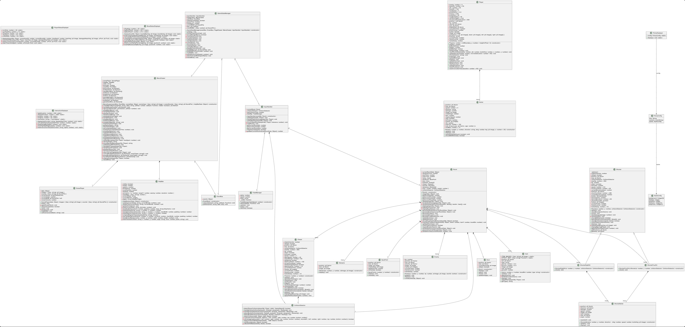

# 2025-group-17
2025 COMSM0166 group 17
## Your Game

[Link to our game!](https://uob-comsm0166.github.io/2025-group-17/public/)

Your game lives in the [/docs](/docs) folder, and is published using Github pages to the link above.

Include a demo video of your game here (you don't have to wait until the end, you can insert a work in progress video)

## Your Group

 

| Name | GitHub Profile | Email | Role |
|-|-|-|-|
| Yishan Chen  | [shandy-del](https://github.com/shandy-del)         | sf24245@bristol.ac.uk   | role |
| Yuetong Dong | [Catherinett-111](https://github.com/Catherinett-111) | wv24137@bristol.ac.uk   | role |
| Shuzhou Huang| [EnjoyerGG](https://github.com/EnjoyerGG)           | uq24650@bristol.ac.uk   | role |
| Hong Jin     | [h-d-jin](https://github.com/h-d-jin)               | sd24459@bristol.ac.uk   | role |
| Yuzheng Li   | [Kkan6](https://github.com/Kkan6)                   | nb24046@bristol.ac.uk   | role |
| Zhexing Yang | [ZhexingYoung](https://github.com/ZhexingYoung)     | ec24179@bristol.ac.uk   | role |

## Kanban Board
https://www.notion.so/1827d976fa2680a4b440cbe594a6a63d?v=1827d976fa26807b9c51000c642e4ac8&pvs=4

## Project Report

### 1. Introduction

Our game *Out* is inspired by *The Binding of Isaac*, a well-known 2D action-adventure and RPG platformer created by Edmund McMillen. Like the original, players move through a series of thoughtfully designed levels and enemies, using projectile-based combat to fight monsters in different dungeon settings, gaining points and gradually uncovering the story.

But *Out* adds several unique features that set it apart. On top of the familiar gameplay, we’ve introduced a system of procedurally generated obstacles and a timer mechanic. These additions are designed to encourage players to replay the game, pushing themselves to beat their previous times and enjoy the process of self-improvement through challenge.

Artistically, the game features original hand-drawn visuals that help tell the story more immersively. In the end, we hope *Out* can be more than just a fun game—it’s also meant to be a space for reflection, where players might see parts of their own experiences echoed in the journey.

### 2. Requirements 

<!-- - 15% ~750 words
- Use case diagrams, user stories. Early stages design. Ideation process. How did you decide as a team what to develop? -->
<!-- Early stages design & Ideation process -->
We started the ideation process by exploring games on the markets in Week 1 and came up a list of possible game mechanisms and ideas. After brainstorming and discussion in Week 2, we narrowed down the list to two ideas below. Despite the rest of the game ideas have not been prototyped, the mechanisms extracted from them, such as using random events to improve users' engagement, have set the foundation for the finalised game. Finally, we considered the feasibility of implementation, and the feedback gained from other teams during the workshop in Week 3. As a result, we decided to go with an action advantage game similar to The Binding of Isaac.

Prototype Ideas Video
https://youtu.be/wU7b8NAj1_g?si=eox95n0rkYJhKN4H

<!-- TODO: Finalised two ideas -->
| Game Idea | Inspried by | Game Mechanisms | Possible Challenges |
|-|-|-|-|
| Out | The Binding of Isaac | <ul><li> Players aim to reach the end of each level to complete the game </li> <li> Random items/events will give players unique abilities </li> <li> Save point enables players to reload the save data when they died </li></ul> | <ol><li> Careful design for collision detection to replicate the experience of the original game. </li> <li> Make sure each level is unique and has a reasonable difficulty curve </li></ol> |
| Majhontro | Balatro | <ul><li> Players aim to score higher points by different combinations of the current tiles </li> <li> Boss levels introduce restrictions on card playing or drawing </li> <li> Random tile generation ensures the game replayability </li></ul> | <ol><li> Replace suit logic with a Mahjong tile </li> <li> Design tile combination and rules for bonus points </li></ol> |

<!-- Reflection on requirement engineering -->
During the workshop in Week 4, we explored the process of requirement engineering by identifying various stakeholders and determining their expectations. To estimate the user value of our game, we utilized the onion model to hierarchically consider stakeholders and gather potential requirements beyond our team's initial scope. Outlining the epics and user stories helps us break them into smaller, manageable tasks, specifying what the team should build in each sprint cycle. This approach ensures clear and measurable requirements, detailing the time and effort required from the development team. By assigning smaller tasks to each team member, we minimize the impact of adjustments, keeping our team agile and adaptable. We also consider the diverse needs of different users, which allows each team member to focus on independent and achievable goals, thereby reducing the risk associated with complex objectives. The acceptance criteria are crucial for identifying deliverable outcomes and prioritizing solutions that work for most people. Furthermore, communicating requirements within the team enhances our ability to gather feedback among the team members and reflect on changes before modifying the actual code. With the help of it, we can be more flexible to the demands that change frequently, which fits the spirit of agile development.

#### Epic and User Stories
**Epic 1: Players with different gaming experiences**

As a player,
I want to get inspired and relax during the gameplay,
so that I can enjoy the game regardless of my previous gaming experiences.

| User Story | Acceptance Criteria |
|-|-|
| As a **casual player**, I want to save my game progress frequently, so that I can return to play without losing significant progress. | Given the player reaches the end of each sub-level, When the player passes by a save point, Then the game saves the current progress and provides a confirmation message. |
| As an **explorer player**, I want to explore all the easter eggs and gain all the achievements, so that I can explore every interesting aspect and experience of this game. | Given the player reaches the optional challenge level/room, When the player beats all the enemies in this room, Then they would gain different skill sets or bonus points. |
| As a **competitive player**, I want to see trackers for my performance, so that I can compare with other players. | Given the player completes all the levels, When the end screen is displayed and the user enters their username, Then the player’s name and score are shown along with their rank on the leaderboard for that level.
| As a **new player**, I want to learn the basic controls and terminologies, so that I can quickly learn how to play without frustration. | Given the game is started for the first time, When the user selects "New Game", Then an interactive tutorial provides step-by-step guidance on moving, jumping, and collecting items. |
| As a **story seeker**, I want to meet all the items and unlock all the elements of the game. | Given the player has finished all the levels, When every time play the game, Then new grap of the game will be achieved. |

**Note**: The potential stakeholders are marked as **bolded** above.

Onion Model
 

Use-case Diagram
 
### 3. Design
<!-- 
- 15% ~750 words 
- System architecture. Class diagrams, behavioural diagrams. 
-->
#### 3.1 System Overview
The design of Out follows a structured and modular object-oriented architecture, informed by key principles of encapsulation, abstraction, inheritance, polymorphism, and composition. This structure effectively organizes game mechanics into clearly defined components that interact seamlessly, simplifying development, testing, and future maintenance.
Encapsulation ensures data integrity and controlled access to game object states, safeguarding mechanics such as player health, movement, enemy interactions, and obstacle collisions. Abstraction simplifies interactions by exposing only essential functionalities, reducing complexity. Inheritance and polymorphism enable flexible designs, notably within enemy subclasses that each exhibit unique behaviors derived from a common parent class. Composition allows for the assembly of complex objects from simpler components, ensuring modularity and ease of incremental integration.
#### 3.2 Class Design
The class diagram clearly outlines key classes, their primary attributes, and critical methods:
- Player: Attributes include health, velocity, and position. Key methods: move(), shoot(), updatePosition().
- 

<!-- 
 
-->
![class diagram](https://www.plantuml.com/plantuml/png/tLnFRnmvTh_tfo1ysPwesx6zzcJGa8njgILB6CiIrDeT3mR6W5r5TTEg9WiaIrAlruSW661pI3P0SieXsLjE6I0ma4pWBF9bnkFaMmIFP5NnNxNQuvqWo6Mivdjy9Dy__lZ8cbz8XOMgbaMlzpFqm--_U_UVV_73N__Jkz_-w_itRz-__STULc0fqHEy95E55Jd63C-9GAzw20qfAojrY5bU4352Hyule9xYEPa8V0sqOy8gypTGo1LXQhUI8xHl_zBI98oonvTbGHJ9HsZ6UK4m0rg9AqdEwPAC4AkMCoD6qIMPbeGfjp6hX02PJuv7g7nqTyehbX_GWW3jWXOAPbC-klkKNvzYgSSLd2ztdnpB4Ng5lheagrhQ2ry0Ujth8RGLQg8VBsQ0qaiVe6w5VOAsjpFEf19LfhXu_1Z6gieSAzB_P8IkECsXPQ6vJmky8cAwu5nHDdVeGxdWLP6V4POJ0GC3pL5ZjY3PvHHVaLDEcUf_CchwuIi2AvjWXTtn2expLBjsccVa6cZk-898eeB6BMsyi54GMIsZLd93rJa_nfJLis-457W5xKl2AcsJaBZxvBWlWU2RBUOwuEACysMVifpSrCRsriPB4EQgbQYgr9t0MK0PHtdSSuZpbvLKUvXTOVa5LOknB4ccph2YF50I_JNPLKmshQzxDj1g7p81fdrBZj39x2N9bFQ_cg6Vz1XPpMGcw8mOjnmXgGHbym7AS57CS7OvGWSLonJbp5LCDIkeN8HzSgpm266sYcRP-hIU9nhAZ33hbYCqRNzeue8KvIuM8tHe_Z0z88RgiNJBJB4ZroIwCPagDEyUPugoYcXpxnTaIPYgQTOp8zBIEXRetYL-zQBkUGg-cX9vflqrHTc_eIfgrpw_VgYd7ETFiLGGZnqZGfH5f3bUafCh8XAIWRxL6YUPcxIf9jgqngriqz5oxgH0OnUJ0e-MU4xGQykd8wk3qqcM0sJDxWwLybaqp0I1V0hAgfJYh4-NyrEi5gqd5dX6YlRdwkJYGf8cxQUyUu0MDCy9QzBV9v4UJIuzvfNKwkpF57DvslY0Y2svf23NpZ3WZQRaTDxIoIEHqkePn6aK3I5LJS7wEfRwaRZJshrYqXFh7h079KQpNkNromM-JarG4v933PikSjvNL1LDA8VTkwQpDJSRXTvBWT1c0bZ74VE8xX8RX11Jwm4RbhxY2XSkSF24BVYrrhAnglHaAJwV5wIJ37rDJkZkt4s7thLcklklun3j7b_gL7ioUpb29kiEK0IDNDjHQJAqjOYJWYFu48ds3MK0YlQGNSLEROnuypHU1rH1f2HvGgJZdMPYWi-1EOg8P-H6JHKNgwVK3ugX4fYPmS_vFikZg1aAeYh1plcf85TwuQcLDTmPPqhm0ZBixkfpifBzcJ61dsy7I2VOyrL9PAsNhrvuiuPrVBoO9RyYkqHT4y9k4-ORklQWv79ROAZXM2ScSN6gmIKMP0CY6Y7uhsxaHK4bvMn2587qFa9xOHFm5LYgXX1Y-WkSa-Ev6A43-CD0R8rxt4be5ARN0cElWyvhh9p6qkiw69cxLL4G9TTnQdkTSt1N3HfJ0SeB8Z3B4dbf2A1RztF6dXErrohzIAFVHciEzIcv8aKt6Je_upurE7S5HuOvKSVunXzRuEipYuERdRsHsBYD0mEDr-GElpxm0QvOZpaq-DuCS3X-gKSUeR4GUBMjVq32UEnmX42pyzY8VeDOLHJ0mZYLv8Wf0fccEILgvtIMsiyzQBN16WTemnKc7HssFFTmWSkoM3s3gUvVN93CtUYtREAlJUrRUekH6vVRO93mf1KVZc1BDlbMmyDd6dVxMA1n2Ni0CEvmHIMT0N1ml6r1w7pXdUTvYJDNtGORdyIjDEDiRu75bFxQhnB0fX6qOKQNS2fZeFDLYoCL5dEYlcmR29QKpTlVUILiFzDYFTJK0yg41MisvBfdSFHfd4-nezppoj8uZt5agppOlHvhhxCD_PUIizjGTfqGKrCOeEG4eint3WxoemGCZO1nhNRNpRG3fwM69yAWr-TaLICZCB9ZjXBdkMUtIx9gzFWvMHqfidmSI-jVajLKZztEuQOLidBcqTe8-avBab5SWFlXJ17HpnPmtbqdOu20vmkQmpcdOzxHE6TaNXLOVCWudWp0DPWo6SgHyShzNK3WQx3-BiukvqBd17sAU9vUc37cyuzQgh6iCs1QYTU-L3z_11RM_WkU0gK3hzAHbeqBEcUEZ_C2C4sp044kw4rdgekWZqvwMxd-PRQAXYK54FZivLY8aQwych3MsCx9rmQ_x3EoNBMI2FpK7JK1m2MVIOMpWkZM4_l31Of3Hr9D_pY9Tfa6AhMYPlgtxcL86lj-hFn00viD4ibg1O3csmsSprxkEY37BQRoPLcfLbDZGJ1qThXVeO9SE7KAuNedWC2o_J7ZIW6SDhzVcueuOFS2boL0qvb62UEFaWeD86NtewJuVXZe3mgVHl7M5DgjroXoYyf3gdPXNbYi0Wqw-gRIY3sawWjS5AvqGsZP4Me3qJb86Do1YtA1tNGZIq9oho7SeB_cx9ZcRNL9Rx-Eu3uSMwQkc7HrLbTUrfPYuv9_0F2sg1ndYbvvwEsrlhpvxhiVVlkxTz_-m_T_-5kxTXTzB_7DeZ4fsa4_rr0AIp9MbqxpetjQHucs9RuPgqkqW-xVgt_h9QCTz53toJ82XnfO4SY_gxak1CrioxsxdptIWsfh0IP3E-X1BMlNRNseMpFCzC5iFCSK12XH4NlBmTKUvyM4NxD9rGvf9bRNwj0E0EXVDGVFTlaQVfA26mpfCKaD5Rscd4gDXMCAPLUKPO1YuHmhF91QK7QvnokcWdPpV6oJKtCIQiy47aJLvuAgRAcGpt9-pVmM4ynkYmtejic0rPmAaXaC6o7G0u63uxZGHyDe5RfzGWhiduFi4UZ6yHsOLntRpkwATknUVSHEwGqfq9-Y1ycOcHCrLfVHURRrbeXqM4PDn_WcR9MQaP7hmp81UFKz5fnnJOtHOniW9pe6gFNcjgq3YFb1VbZsht1HaNC-plEsG-jJa_2miOC-lUSUl20C-f4ztOiTVat4Byj-NCG0x_Jl3hUicyVClxAHubBqCVF0ndO_r5ogXwqLnZN2BK6kY51fYYu5Uq7MpzUffRr8WttUP3u_xkliS7lSTsI8HB3gS91khFqHWqglf0F-BXol9Ep8dnaa1LqDMhif9NQSs15qRIydVQuM5gSsEtG0UnTOrZkENE3BHC54R-KJWeCR_etDiccTSGb1xpZ9PsPtyBs1oiCAxjZS6WIDJUP11DW2JJrBBgO1mMnd6MZX3BDv8sG7tJUxA9KJB1VwvEEC2Q9WGpDvlHt6JDawKi1GzvjWCFQuB0iQl9hGr3XQxhj2OJPH4VOdScSO-u7sQUCcIQVUq4br0feqo_US5OJRhIXyim0zl0SL5amwJGfV4YiqnoQY4cVK9HQNO-t6VJybLqM-Iyu8b823Mkhcfo9lCIIxJ7U9SMz7zDeccEmkbnBkLrlZXZezfCfM3YyAB1UUkQDmr_3CnllsDfv91GK5RRF_p-5_x-vdTPa_4RMVkl5rdE09O9Y_uXhR1a8VVEPAdQQuF7XfBUEYp6ii66NpCDfjSn9jD3CYGfU2JvYdgvyoKTmpbNKpUCVsjualR9XFJ9nPeDf6MWItDamKpKtG_zKqeJi4TQY9zidrK62uQJAnV5yOxuel8pPEDWR2k_3G3HYWrSU0jZrCK0Uy4XDgQt1-M_-dyZ7VNy8PxSFX9vnItVY_D1NZ5mQiRPw0msJuiFDKwKT51tQcZ2gAYp6R5q7EfLvc4rpf_3GDgpMwV7Hh2a-dge9U47zNltdgDBKGJ0bCY_e6uHKgkNIqCa3ECj7hnqs7O-mUXUz3zGFCOSjZQID7cXoWVDdKoP4NRWCaFUpvum6-oLE7LFMRQp_twTG6YIjqy0sSgsiFZFqcAj6b72doWuJpOi_DdD3Rr2QUDGR8crXT33ZoKcBA9eswrrR-0ZCr6eR2HFGGOnBShlEcab_vBwGr3Wv1G5OGBC96giXIZX3SbfbmaVNJuH5gNX5hWt78HHDkT0p5TWgnPcljpOa8yfN-rqepcc-mYccjvotTqdzhpLVhhtpiEu3DC28esJoqI2PDU4tdNUVxEz9PynHutMkBF-fJZTjVjTYx733PASqkRtdIud3RPosttAE0H-WcunC9PrqtckKviegc_fkscWoe0ifkbVGVm32eBPFQ9sI_m_SJVVQDGtv03ti-JL1gi90W7L262vXz-7Z7cAsUHKI8HTg7U1F1Ir3qcEKcuVPdNCgJhWkItB8V2Bw4QS23ih27CQ5pDGi_ltHlUk2zshApQ3c-K4JiGRA8mBDktUCiRt2Q0pS5aRou8Z2jDBY6cnmdONs0hSuhnGN5nSbCzlbCfhc7zhi4I76kxFWTVvDb8PrzA3QgYogS2syJiBTv9V7EJx0AO4tddyGkpKlYQIqhk2InGnrv5P7s7PyYTjiuEjy__lheUFnaVxhsQHBQteQxC9gP4_t-mS7-tldNn-FJHA_wCYlgrQ6zAtZHxRMeLUdTkiq5ld8g1_hS_K0VSddbl9pJxGyxG472HkOzmPSU203LTEpzGKGCa3lDpG2NUPJrn2od7wNV9tf2oR18-82MPGzDwruhpeb-KUgyy6qSeOwq3_NkKBymJ2shGtjy5XIbDtBr5alMAEDZfrf__4JoA2uB-mr6X7xadkdHXgp6YytdKnjNBrC5TIFQNV7Fq2-Fx4TttlMjsGidHaRpwLt6cNldfEzCWy03dbF_cOq-XGHiYvZdGIZgQWEUYfu7J-s0ww7BjHOeD0-7WbkBfjqW8YSGmqVk00QnyE4tVCO4_-Q72L953pWpTwJmXpL6i2wuW3yak50BU6oNcFO73TezXWiB-n-eYeqNOgxG4fgp4he5E6M31g05Jhc9bopWoQBvMEQvo_VWxgDkpYzTpZ_pELsVYi0ED1o2dC0yfdq3mvI2b89dH4hD9FiVBJ73HLOLS0UBHLtKUjuXjW7_eGpznTHXUKf4HfZ2SxlbTwm_bDbiy0b7BvqdTudU0rJduES1S0g4-UKzcK2kwyFWiEmllFNzc4dKAnATPjj4aFCXH7Dm2JmVtlya2kYFxeNkNrTFKxTo4VECtmJfzDEGvOApAEMcU0xmaXODN4CxwCwICovBd94xNT6KV2fPFuO9YmYtEFiO7btrrtHE-ZdORq9nmUUx_ARlFTnQOt0wNnHG4zZF8M0txENOjlkTw6soz2x-xjk___xV__Bxxzw-_vUtzKRE2vgjV9_Hj-hiWiv7bhodVpdYaE4Aq8F7u0putz_yrVi_V1kEQOMQ0Us7UjFc0owKrIjyIgNQDWJzKIQIQgLhC5FurqXnH_lXz__sxZz-z-wV_oOSrk6teywQX0AVl2io9-Ahdxze9sJSrr9C3vwlubRDl6SUuTPoxhzeEiGKCzrltlpNd__Tks_Ul7_pjXVQOJXyxEjfX8nDUbwhvdCNXaPMFxsU7UFzcxT6CRteVvLmv_uTn8T3_M_p4VDQBk__fB2Mq_d_AlISZxA1z2UMnVqQkuEb_Yux84UJxdbVWhaIukfQn5fBqv-BTLAzpxxiyyLce2Lcgpks6jNhsQScwwVHgs-ejtyp70QtGKbQVGNJzAolZe9PU6NZNdYfivQvf-ktw-STiUZYQjJQLc5zaXbMrr-JbFhKbYJ2OJX9C1fFaWBDhc5f5VmBml9gMVmF "class diagram")

### 4. Implementation

- 15% ~750 words

- Describe implementation of your game, in particular highlighting the three areas of challenge in developing your game. 

### 5. Evaluation
#### 5.1 Qualitative Evaluation - Heuristic Evaluation

| Name | Interface | Issue | Heuristic(s) | Freguency 0 (rare) to 4 (common) | Impact 0 (easy) to difficult (4) | Persistence 0 (once) to 4 (repeated) | Severity = Sum Total of F+I+P/3 |
|----------|----------|----------|----------|----------|----------|----------|----------|
| Hsinyun Fan | Tutorial Interface | Don't know when player is attacked by enemies. | Visibility of system status | 2 | 2 | 0 | 1.25 |
| Kailin Fang | Tutorial Interface | Instruction could be more clear (like use picture to show). | Help and documentation | 1 | 2 | 1 | 1.33 |
| Daisy Fan | Tutorial Interface | Can pop up instruction first then begin. The HP not very clear. | Help and documentation | 1 | 2 | 1 | 1.33 |
| Brian | Tutorial Interface | Don't know how to win or play when just eneter the game. | Visibility | 1 | 4 | 1 | 2 |
| Kaijie Xu | "Playing" Interface | Player identification | Recognition rather than recall. | 2 | 2 | 4 | 2.67 |
| Rowan | Pause Menu | Hard to see the pause button | Visibility of system status, Consistency and standards, Error prevention, Recognition rather than recall, Flexibility. | 1 | 1 | 0 | 0.67 |
| Rowan | "Playing" Interface | Difficult to avoid enemies | Visibility of system status, Consistency and standards, Error prevention, Recognition rather than recall, Aesthetic | 4 | 3 | 2 | 3 |
| Aya | "Playing" Interface | Hard to defeat enemy, takes many shoots | Flexibility and efficiency of use | 2 | 3 | 2 | 2.33 |
| A | "Playing" Interface | I'm not used to operating keys. The display of the player's health is not very obvious and is not easy to see at a glance. | User control and freedom. | 1 | 0 | 1 | 0.67 |
| A | "Playing" Interface | The monster is moving too fast. It is better to show the monster's health. | User control and freedom. | 2 | 2 | 1 | 1.67 |
| James | Tutorial Interface, "Playing" Interface | It’s a little bit hard for recognize the tutorial image of the first level. | Visibility of system status, Flexibility and efficiency of use | 2 | 2 | 1 | 1.67 |
| James | "Playing" Interface, Game Over Interface | Hard game and hard to find the button to restart the game. | User control and freedom, Recognition rather than recall | 3 | 3 | 3 | 3 |
| Farid | "Playing" Interface | Bullet is a bit too slow | Visibility of system status, Flexibility and efficiency of use | 3 | 2 | 3 | 2.67 |
| Jacque | "Playing" Interface | Collision with box, health visibility | User control and freedom, Aesthetic and minimalist design | 2 | 0 | 3 | 1.67 |
| Ziqi | "Playing" Interface |  | User control and freedom | 2 | 2 | 1 | 1.67 |
| Hao | Start Menu | The playing button is too small | Aesthetic and minimalist design  | 1 | 2 | 1 | 1.33 |
| Beam | "Playing" Interface | Collision detection is a bt off | User control and freedom | 4 | 3 | 1 | 2.67 |
| Marek | "Playing" Interface | Too small buttons starts very quickly, once you play it more bcomes easier  | Visibility of system status, User control and freedom  | 1 | 1 | 3 | 1.67 |
| Oliver | "Playing" Interface | Enemies can phase through the obstacles in the level, which is unintuitive that the player can't either. The hitboxes are quite tight which can halt movement if you're colliding with 1 pixel | User control and freedom  | 1 | 1 | 3 | 1.67 |
| Luciano | Pause Menu, "Playing" Interface | Sometimes movement didn't work. Obstacle location being random each time can make level 3 easier than level 1. | User control and freedom, Aesthetic and minimalist design  | 2 | 3 | 4 | 3 |
| Alexandros | "Playing" Interface | The hitboxes on the blue computers were a bit too big | Flexibility and efficiency of use  | 3 | 1 | 4 | 2.67 |
| Ashby | "Playing" Interface | The obstacles looked smaller than they actually were. It was a bit easy to just spam attack.  | User control and freedom, Consistency and standards, Flexibility and efficiency of use  | 2 | 1 | 3 | 2 |
| Asher | "Playing" Interface | Hitboxes too large, not obvious that music notes stop when they hit obstacles, cannot move left or right when also moving into an obstacle, saving is not clear | Visibility of system status, User control and freedom, Consistency and standards, Flexibility and efficiency of use, Help users recognise, diagnose, and recover from errors | 4 | 3 | 0 | 2.33 |
| gg | Start Menu |  | Flexibility and efficiency of use | 1 | 3 | 1 | 1.67 |

*Heuristic Evaluation Results*

We conducted two questionnaire collection activities. A total of 24 feedback from 21 students were collected, which is shown in the above table.

| **Category**                           | **Manifestation**                                                                                                                                 | **Impact**                                                                                      | **Suggested Improvement**                                                                                      |
|----------------------------------------|---------------------------------------------------------------------------------------------------------------------------------------------------|--------------------------------------------------------------------------------------------------|-----------------------------------------------------------------------------------------------------------------|
| **Lack of Visibility of System Status** | - Players don’t know when they are attacked.    - Health display is unclear.   - Bullets are too slow, lack timely feedback.   - Enemy health is invisible. | Makes it hard for players to understand game status, leading to frustration.                   | Enhance UI elements like health bars and attack indicators to improve real-time feedback.                      |
| **Insufficient User Control and Feedback** | - Unresponsive or unintuitive key controls.   - Movement restrictions (e.g., stuck on collisions, can't move sideways).   - High difficulty, restart button hard to find.   - Unclear saving system. | Reduces sense of control, potentially causes players to quit.                                   | Provide clear control prompts, customizable keys, and visible retry/exit buttons.                             |
| **Lack of Help and Documentation**     | - Tutorial is unclear or disorganized.   - Players don’t know how to start or win the game.                                                   | High entry barrier, poor tutorial experience.                                                  | Use visuals, step-by-step popups, and task hints to enhance guidance.                                         |
| **Inconsistency & Aesthetic Issues**   | - Buttons are too small or not noticeable.   - Visual and actual collision of obstacles are inconsistent.   - Enemies or obstacles are too fast to react. | Reduces interface usability and predictability.                                                | Unify visual style, optimize hitboxes, and highlight interactive elements.                                     |
| **Recognition Over Recall**            | - Players can't easily identify their character or elements.   - Difficult to remember how to restart or continue the game.                    | Increases cognitive load by requiring memory instead of recognition.                           | Strengthen visual cues, add icons and labels to assist recognition.                                           |

*Usability Issues and Suggested Improvements in Game Design*

The feedback of personal user experience is concluded and classified into five categories with each category has various manifestation, suggested improvement, and impact as shown in the above table.

#### 5.2 Quatitative Evaluation - System Usability Survey (SUS)

| User ID | I think I would like to use this system frequently | I found the system unnecessarily complex | I thought the system was easy to use | I think that I would need the support of a technical person to be able to use this system | I found the various functions in this system were well integrated | I thought there was too much inconsistency in this system | I would imagine that most people would learn to use this system very quickly | I found the system very cumbersome to use | I felt very confident using the system | I needed to learn a lot of things before I could get going with this system |
|---------|-----------------------------------------------------|------------------------------------------|--------------------------------------|--------------------------------------------------------------------------------------------------|------------------------------------------------------------------------|--------------------------------------------------------------|-----------------------------------------------------------------------------------------|------------------------------------------|-------------------------------------|------------------------------------------------------------------------------------|
| User 01 | 4                                                   | 1                                        | 4                                    | 1                                                                                                | 5                                                                      | 2                                                            | 4                                                                                       | 2                                        | 5                                   | 1                                                                                  |
| User 02 | 4                                                   | 1                                        | 4                                    | 1                                                                                                | 5                                                                      | 2                                                            | 4                                                                                       | 2                                        | 5                                   | 1                                                                                  |
| User 03 | 5                                                   | 1                                        | 5                                    | 1                                                                                                | 3                                                                      | 1                                                            | 5                                                                                       | 3                                        | 5                                   | 5                                                                                  |
| User 04 | 4                                                   | 3                                        | 3                                    | 3                                                                                                | 3                                                                      | 3                                                            | 3                                                                                       | 3                                        | 3                                   | 3                                                                                  |
| User 05 | 4                                                   | 2                                        | 4                                    | 3                                                                                                | 3                                                                      | 3                                                            | 3                                                                                       | 3                                        | 3                                   | 2                                                                                  |
| User 06 | 4                                                   | 3                                        | 4                                    | 3                                                                                                | 3                                                                      | 3                                                            | 3                                                                                       | 3                                        | 3                                   | 3                                                                                  |
| User 07 | 5                                                   | 1                                        | 5                                    | 4                                                                                                | 5                                                                      | 1                                                            | 4                                                                                       | 3                                        | 5                                   | 2                                                                                  |
| User 08 | 3                                                   | 3                                        | 4                                    | 3                                                                                                | 4                                                                      | 3                                                            | 2                                                                                       | 3                                        | 2                                   | 4                                                                                  |
| User 09 | 5                                                   | 3                                        | 5                                    | 2                                                                                                | 5                                                                      | 1                                                            | 2                                                                                       | 3                                        | 5                                   | 1                                                                                  |
| User 10| 4                                                   | 2                                        | 3                                    | 3                                                                                                | 5                                                                      | 3                                                            | 4                                                                                       | 3                                        | 4                                   | 2                                                                                  |
| User 11| 4                                                   | 2                                        | 2                                    | 4                                                                                                | 5                                                                      | 2                                                            | 3                                                                                       | 2                                        | 2                                   | 2                                                                                  |

*SUS Results of Easy Mode*

| User ID | I think I would like to use this system frequently | I found the system unnecessarily complex | I thought the system was easy to use | I think that I would need the support of a technical person to be able to use this system | I found the various functions in this system were well integrated | I thought there was too much inconsistency in this system | I would imagine that most people would learn to use this system very quickly | I found the system very cumbersome to use | I felt very confident using the system | I needed to learn a lot of things before I could get going with this system |
|---------|-----------------------------------------------------|------------------------------------------|--------------------------------------|--------------------------------------------------------------------------------------------------|------------------------------------------------------------------------|--------------------------------------------------------------|-----------------------------------------------------------------------------------------|------------------------------------------|-------------------------------------|------------------------------------------------------------------------------------|
| User 01 | 4 | 1 | 3 | 1 | 4 | 1 | 5 | 2 | 4 | 1 |
| User 02 | 4 | 1 | 4 | 1 | 5 | 2 | 4 | 2 | 5 | 1 |
| User 03 | 5 | 1 | 5 | 5 | 5 | 3 | 5 | 3 | 5 | 3 |
| User 04 | 3 | 4 | 3 | 4 | 2 | 4 | 2 | 4 | 2 | 4 |
| User 05 | 3 | 4 | 3 | 4 | 2 | 4 | 2 | 4 | 2 | 3 |
| User 06 | 4 | 3 | 4 | 3 | 3 | 3 | 3 | 3 | 3 | 2 |
| User 07 | 4 | 2 | 4 | 2 | 4 | 2 | 4 | 2 | 4 | 2 |
| User 08 | 2 | 4 | 2 | 5 | 2 | 5 | 2 | 4 | 2 | 3 |
| User 09 | 5 | 2 | 5 | 1 | 5 | 1 | 5 | 3 | 5 | 1 |
| User 10 | 3 | 2 | 3 | 3 | 3 | 3 | 3 | 3 | 3 | 2 |
| User 11 | 3 | 2 | 2 | 5 | 4 | 2 | 1 | 4 | 2 | 2 |

*SUS Results of Hard Mode*

| User ID | Easy Mode | Hard Mode |
|---------|------------|------------|
| User 01 | 87.5       | 85.0       |
| User 02 | 92.5       | 70.0       |
| User 03 | 80.0       | 75.0       |
| User 04 | 60.0       | 40.0       |
| User 05 | 65.0       | 45.0       |
| User 06 | 70.0       | 65.0       |
| User 07 | 87.5       | 80.0       |
| User 08 | 55.0       | 35.0       |
| User 09 | 80.0       | 92.5       |
| User 10 | 67.5       | 55.0       |
| User 11 | 60.0       | 42.5       |

*SUS scores of Each User in the Easy Mode and Hard Mode*

Higher SUS scores indicate better perceived usability. The Easy Mode has higher usability score than that of the Hard Mode, suggesting that users found the game more intuitive and accessible in Easy Mode. We conducted the Wilcoxon sign-ranked test on the SUS data. The results show obvious significance. For a group of 11 participants, the calculated test statistic W is 5.5, which indicates that the significance level reached 0.025, or 97.5% according to the critical values table. The result determined that there was an significant difference between the easy mode and hard mode. However, this result does not determine exactly what causes the difference between the two modes. This uncertainty about whether there is really a difference in the usablity of two modes is related to one or more items of SUS.

| SUS Item                                                                                 | Easy | Hard |
|-----------------------------------------------------------------------------------------------|------|------|
| I think I would like to use this system frequently                                            | 4.2  | 3.6  |
| I found the system unnecessarily complex                                                      | 2.0  | 2.4  |
| I thought the system was easy to use                                                          | 3.9  | 3.3  |
| I think that I would need the support of a technical person to be able to use this system     | 2.6  | 3.1  |
| I found the various functions in this system were well integrated                             | 4.1  | 3.5  |
| I thought there was too much inconsistency in this system                                     | 2.3  | 2.5  |
| I would imagine that most people would learn to use this system very quickly                  | 3.4  | 3.3  |
| I found the system very cumbersome to use                                                     | 2.5  | 3.1  |
| I felt very confident using the system                                                        | 3.8  | 3.4  |
| I needed to learn a lot of things before I could get going with this system                   | 2.4  | 2.3  |

*The average score of each item on SUS of the easy mode and the hard mode*

The average scores of the easy mode and the hard mode are 73.2 and 62.3 respectively. The latter is lower than the general usability benchmark of 68. Based on the results of the above table, we decided to improve the control methods of the player, the collision logic between classes, and the UI design of non-game interfaces to enhance the integrity of the hard mode system and make it easier for users to master and proficiently use the game system with the expectation of bringing the usability score of hard mode to the 68 benchmark.

#### 5.3 Improvements of the final version
##### Enhancing System State Visibility
- Add clear attack indicators when the player is hit (e.g., shaking the player image, damage flash), and optimize real-time feedback for health bar/heart icons.
- Display dynamic health values for both enemies and players, providing immediate visual effects when bullets hit and enemies take damage.

###### Improving User Control and Feedback
- Add clear buttons for restart, exit, and continue on the interface.
- Optimize collision detection to avoid getting stuck against walls or being unable to move sideways, and clearly indicate the save and restart processes.

###### Enhancing Help and Guidance
- Set up tutorial levels before the game starts, and add task prompts or concise graphical/text tutorials to help new players quickly grasp game objectives and controls.
- Provide a skippable quick guide mode to lower the learning barrier for experienced players.

###### Unifying Interface Style and Aesthetics
- Standardize UI visual elements (buttons, fonts, colors), highlight interactive areas, and optimize the visual/collision detection of obstacles for consistency.
- Control the movement speed of enemies and items (e.g. boss bullets) to ensure players have sufficient reaction time.

###### Strengthening "Recognition Over Recall"
- Add key operation buttons and system operation instructions on non-game pages (e.g., pause interface) to reduce players' memory burden.
- Use consistent and intuitive visual symbols for important interactions (e.g., save points, teleporters) to help players quickly recognize and make selections.

#### 5.4 Testing
###### 5.4.1 Overview
This report documents the testing approach, tools, techniques, and outcomes for our game project. The testing covers both black-box (functional/user perspective) and white-box (code-level/unit testing) techniques to ensure a comprehensive quality assurance process. The goal was to ensure that the game delivers correct functionality, user-friendly experience, and stable performance.
###### 5.4.2 Black-Box Testing
- *1) Team process*
  Agile Development: We adopted the Agile methodology, working in weekly sprints. This allowed us to continuously evaluate progress, adapt based on testing feedback, and incorporate incremental enhancements. Agile proved especially helpful due to our limited prior experience in game development. We prioritized building a Minimum Viable Product (MVP) and iteratively added new features.
  Pair Programming: Pair programming was used extensively to avoid bugs and ensure clean, understandable code. This technique enabled collaborative problem solving and faster testing cycles. For example, in player attack logic, one member implemented the function while the other tested it in real-time and provided feedback.
  Frequent Meetings: Meetings were conducted every Monday to discuss completed work, resolve blockers, and reassign tasks. We estimated complexity using Planning Poker, ensuring balanced workloads and realistic sprint goals.
  Tools Used:
  **Github** was used for version control, branch management, and bug tracking.
  **Notion** supported real-time note-taking during meetings and goals tracking.
  **Kanban Board** organized our tasks into "To Do," "In Progress," and "Done."
  **Tencent Meeting** and **Wechat** supported continuous communication and problem resolution.
- *2) Testing Focus* 
   Our black-box testing included:
   **Gameplay Mechanics**: Verifying that attack, movement, collision, and level transitions work smoothly.
   **UI/UX Testing**: Ensuring layout clarity and button responsiveness.
   **Scenario-Based Playtesting**: Simulating real user journeys from start to end.
   **Bug Logging**: Reporting discovered bugs through GitHub issues for developer review.
   This testing aproach simulated how players would use the game, helping us catch the logic errors and improve usability without needing to understand internal code.

##### 5.4.3 White-Box Testing
We used Jest to create unit tests for validating internal logic of important modules such as `Player`, `CollisionDetector`, and time tracking functionality.
- *1) Player Class Tests*
File: `tests/layer.test.js`
·HP Initialization: Ensures that a new `Player` instance starts with default HP, critical for combat logic.
·Shooting: Tests whether shooting adds a bullet with the correct direction and plays sound effects. This ensures responsive combat experience.
·HP Updates: Includes scenarios for taking damage without death and handling HP reduction to zero, ensuring death-related logic functions correctly.
·Position Updates: Verifies if player movement via velocity is reflected in position, and if `revertPosition()` resets it properly. This guards against invalid movement errors.
- *2) Collision Detection Tests*
File: `tests/collisionDetector.test.js`
·Out-of-Bounds Bullet Removal: Confirms that bullets leaving the screen are removed. This prevents unnecessary memory usage and UI clutter.
·Valid Bullet Retention: Ensures that valid bullets remain active in gameplay, supporting uninterrupted user action.
These tests indirectly verify internal logic like `isBulletHitWall() `and correct management of game objects.
- *3) Time Tracking Tests*
File: `tests/time.test.js`
·Start Time Accuracy: Verifies correct timestamp capture when the game starts.
·Elapsed Time: Confirms that time is accurately computed during gameplay.
·End Message Format: Ensures that completion messages display correctly formatted time (mm:ss), improving end-user feedback and polish.
These tests guarantee that players receive meaningful feedback about how long it took to finish the game, adding an important competitive and motivational layer.

##### 5.4.4 Summary and Reflections
·Coverage: Through both black-box and white-box testing, we covered major user interactions, game logic integrity, and data tracking. Our combination of test types enabled us to verify the system both externally and internally.
·Efficiency: Agile collaboration, pair programming, and code reviews through GitHub ensured continuous quality improvement. Testing was not a final step, but a continuous part of the development cycle.

### 6. Process 

#### 6.1 Team Collaboration and Workflow

At the beginning of the project, we held collaborative discussions to define the core game states necessary for a minimum viable product and potential extended features that could be added later in the development cycle. In hindsight, our progress could have benefited from a clearer overall structure regarding functionality planning and workflow management early on. A more refined understanding of the software requirements and a better-coordinated development pipeline might have streamlined our implementation process.

We maintained regular in-person meetings in the Software Engineering lab throughout the development period. These weekly sessions provided an opportunity to check progress, align tasks, and address any technical or design issues that emerged. Our communication was effective and enjoyable, significantly contributing to team morale and productivity. For day-to-day coordination, we relied heavily on a WeChat group chat. This channel allowed us to share quick updates, raise unexpected issues, and propose small changes in real-time. For more formal discussions, especially those involving critical decisions or feature planning, we used Microsoft Teams and recorded key meetings to ensure that important information could be reviewed later when needed.

#### 6.2 Tools and Technologies

**Project Management Tools:**  
We used GitHub for version control and collaborative coding. Each team member worked on individual feature branches—for example, a dedicated branch was created solely for the menu state. The main branch was always kept stable to ensure that we always had a functioning build available. GitHub’s protection features, including pull requests, allowed us to thoroughly review and test each other’s contributions before merging. This improved code quality helped prevent merge conflicts and maintained consistency in implementing features.

Given the complexity of our game, which involved multiple interconnected game states, we adopted Notion as our project management tool. Notion enabled us to track progress on various tasks, delegate responsibilities, and visualize our workflow clearly. We divided work based on game modules and assigned responsibilities accordingly. In retrospect, we realized that we could have further broken down larger tasks into smaller sub-tasks—such as dividing the development of the shop state into UI design, game logic, and asset integration. This would have given us a more granular understanding of our progress and helped balance the workload more effectively.

**Development Tools:**  
For the core of our game development, we used **P5.js**, a JavaScript-based creative coding framework that supports dynamic rendering and a wide variety of extension libraries. Early on, we encountered some difficulties with debugging and extending functionality using P5.js, particularly since many team members were unfamiliar with it. However, through collaboration and consistent practice, we overcame these challenges and gained proficiency, which accelerated the later stages of development.

Regarding visual design, team member **Shuzhou Huang** led the creation of all original artwork. Using **Aseprite**, a pixel art tool, he designed characters, backgrounds, UI components, and animations, all by hand. These assets contributed significantly to the game’s unique aesthetic and atmosphere.

We sourced royalty-free audio from public platforms for sound design and then processed and edited the sound effects using **Logic Pro X**. This allowed us to fine-tune the quality and timing of audio elements, enhancing the overall immersion of the game.

###  7. Sustainability, Ethics and Accessibility
####  Green Software Foundation Implementation Patterns Applied in the Project

##### Deprecate GIFs for animated content
- We removed all legacy `.gif` animations and replaced them with finely tuned PNG sprite sequences, loading each frame via `loadImage` and driving playback with a `frameIndex` loop.  
- This change gives us precise control over frame rate and leverages modern PNG compression tools (animation assets grew from X MB to Y MB, ≈Z% change).

##### Remove unused CSS definitions
- We audited our stylesheet with browser Coverage and regex-based searches, stripped out every unused selector, and now only ship the base layout rules and the `.blink` keyframe animation.  

##### Optimize image size
- We applied automated image compression (using imagemin with MozJPEG/PNGQuant) and resized high-resolution assets to match in-game display size, reducing the total image footprint from X to Y.  
- This optimization cuts bandwidth by Z%, speeds up level load times, and lowers client-side decoding CPU usage for better energy efficiency.

### 8. Contributions

| Name          | Role / Responsibility           | Contributions          |
|---------------|---------------------------------|------------------------|
| Yishan Chen   | Game logic & system integration |           X            |
| Hong Jin      | Game logic & UI                 |           X            |
| Yuetong Dong  | Testing & sound load            |           X            |
| Yuzheng Li    | Game logic & report             |           X            |
| Shuzhou Huang | Visual art & pixel assets       |           X            |
| Zhexing Yang  | Sound design & story script     |           X            |

---

### Lessons Learned:
·Pair testing helps catch issues early.
·Writing unit tests made our codebase more modular and maintainable.
·Regular playtesting helped refine the user experience iteratively.
### Future Plans:
Expand unit testing to include item interactions and enemy AI.
Add automated stress and load testing.
Explore accessibility testing for inclusive gameplay.

### 9. Conclusion

- 10% ~500 words

- Reflect on project as a whole. Lessons learned. Reflect on challenges. Future work. 

### Contribution Statement

- Provide a table of everyone's contribution, which may be used to weight individual grades. We expect that the contribution will be split evenly across team-members in most cases. Let us know as soon as possible if there are any issues with teamwork as soon as they are apparent. 

### Additional Marks

You can delete this section in your own repo, it's just here for information. in addition to the marks above, we will be marking you on the following two points:

- **Quality** of report writing, presentation, use of figures and visual material (5%) 
  - Please write in a clear concise manner suitable for an interested layperson. Write as if this repo was publicly available.

<!-- **Documentation** of code (5%)

  - Is your repo clearly organised? 
  - Is code well commented throughout? -->
